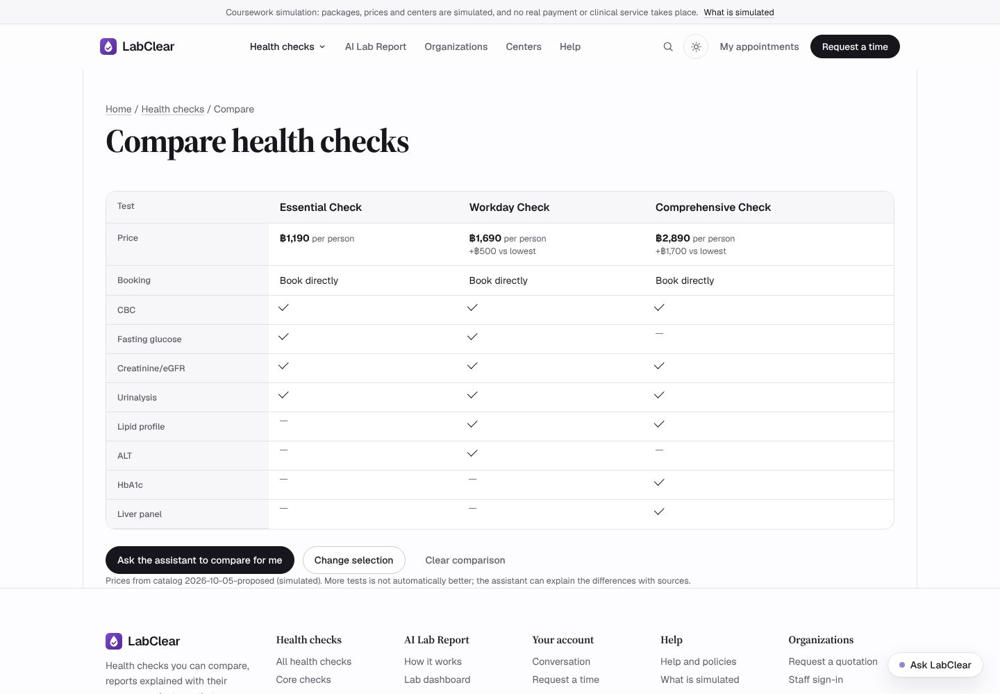
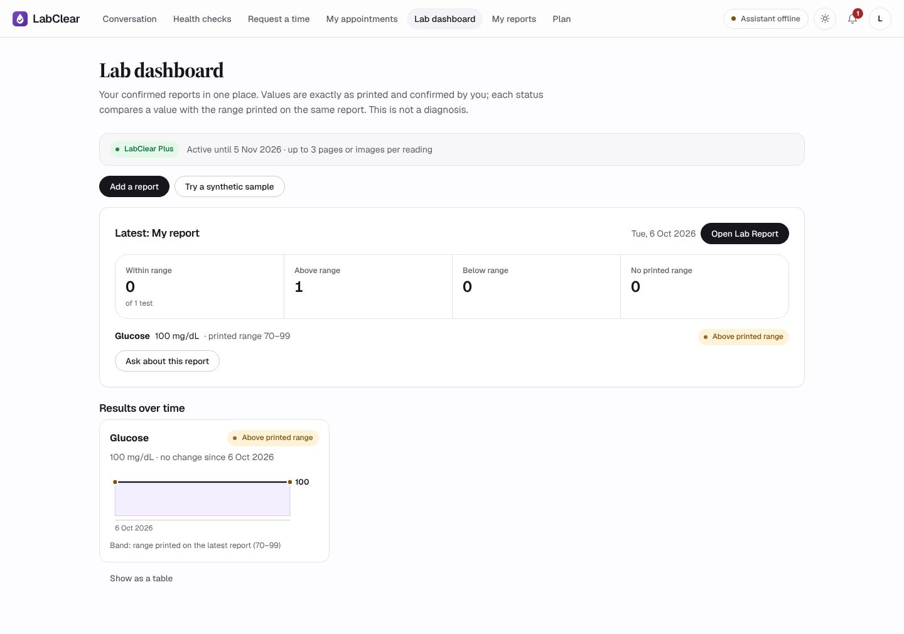

<div align="center">

<picture>
  <source media="(prefers-color-scheme: dark)" srcset="docs/assets/logo-dark.svg">
  
</picture>

### แชทบอทแนะนำแพ็กเกจตรวจสุขภาพ จองคิว และช่วยอ่านผลแลปพร้อมแหล่งอ้างอิง

**Book the check. Understand the result.**


[ระบบจริง](https://labclear.onrender.com) · [สไลด์นำเสนอ](presentation/index.html) · [รายงาน (PDF)](docs/report/LabClear_Report.pdf) · [วิธี deploy](#deploy-บน-render)


</div>

> **โครงงานรายวิชา 06048308 Intelligent Chatbot Development** · ข้อมูลธุรกิจ ราคา สาขา การชำระเงิน และผลแลปทั้งหมดเป็นข้อมูลจำลอง ไม่ใช่บริการทางการแพทย์จริง และไม่ใช่คำแนะนำทางการแพทย์

---

## สารบัญ

- [ภาพรวม](#ภาพรวม)
- [สถาปัตยกรรม](#สถาปัตยกรรม)
- [เริ่มใช้งานบนเครื่อง](#เริ่มใช้งานบนเครื่อง)
- [Deploy บน Render](#deploy-บน-render)
- [การทดสอบ](#การทดสอบ)
- [สไลด์นำเสนอ](#สไลด์นำเสนอ)
- [โครงสร้างโปรเจกต์](#โครงสร้างโปรเจกต์)

## ภาพรวม

LabClear คือร้านตรวจสุขภาพจำลอง 3 สาขา ที่ใช้แชทบอทเป็นด่านหน้า ลูกค้าถามเรื่องแพ็กเกจ ราคา และการนัดหมายได้ตลอดเวลา และให้ AI อ่านใบผลแลปแล้วอธิบายเป็นภาษาไทยพร้อมแหล่งอ้างอิง ส่วนงานที่ต้องใช้คน เช่น ยืนยันนัดหรือคืนเงิน ยังเป็นของเจ้าหน้าที่

| สินค้า | รายละเอียด |
|---|---|
| **แพ็กเกจตรวจสุขภาพ** | 18 รายการ: จองได้ทันที 4 (เช่น Essential Check ฿1,190), ตรวจติดตาม 11 (฿290–฿990), องค์กร 3 |
| **AI Lab Report** | Free อ่านผลแลป 1 ภาพ · **LabClear Plus ฿355 / 30 วัน** อ่านได้ไม่จำกัด ครั้งละ 3 หน้า มี Lab dashboard และเทียบผลครั้งก่อน |

**สิ่งที่แชทบอททำได้**

- ตอบเรื่องแพ็กเกจ ราคา สาขา นโยบาย จากไฟล์ข้อมูลเดียวกับหน้าเว็บ ราคาจึงตรงกันเสมอ
- อธิบายค่าแลปเป็นภาษาไทย อ้างอิง [1] [2] จากคลังความรู้ 58 แหล่ง (ศิริราช, MedlinePlus, ศรีนครินทร์)
- อ่านใบผลแลปด้วย OCR ให้ลูกค้าตรวจค่าก่อนยืนยัน แล้วเทียบกับช่วงอ้างอิงที่พิมพ์บนใบ
- สร้างคำขอนัด ส่งต่อเจ้าหน้าที่ และไม่วินิจฉัยโรค ไม่สั่งยา ไม่แต่งราคาหรือส่วนลด

<table>
<tr>
<td width="50%"><br><sub>เปรียบเทียบแพ็กเกจทีละรายการตรวจ</sub></td>
<td width="50%"><br><sub>Lab dashboard ของสมาชิก Plus</sub></td>
</tr>
</table>

## สถาปัตยกรรม

<p align="center"></p>

| ชั้น | องค์ประกอบ | เทคโนโลยี |
|---|---|---|
| ผู้ใช้ | ลูกค้า (`/`, `/app`) · เจ้าหน้าที่ (`/staff`) | Jinja templates, JavaScript, CSS (light/dark) |
| แอปพลิเคชัน | FastAPI Business API: session, CSRF, rate limit | Python 3.12, FastAPI |
| | **Chatbot pipeline**: guard → plan → retrieve → answer → validate → review → guard | `services/business_agent.py` |
| | อ่านใบผลแลป: OCR → ค่า → สถานะ | `services/report_reader_v2.py` |
| | จองคิว ชำระเงินจำลอง LabClear Plus | `routers/business.py`, `services/business_plans.py` |
| ข้อมูลและโมเดล | คลังความรู้ RAG (BM25, 58 แหล่ง, คำเรียกภาษาไทย) | `knowledge/evidence/catalog.json` |
| | LLM + OCR ภาษาไทย | Typhoon `typhoon-v2.5-30b-a3b-instruct`, `typhoon-ocr` |
| | คัดกรองความปลอดภัยขาเข้าและขาออก | Llama Guard 4 ผ่าน OpenRouter |
| | ฐานข้อมูลเข้ารหัส + ตัวนับ call + ledger งบ 300 บาท | PostgreSQL (Render) |

### 1 ข้อความผ่านอะไรบ้าง

<p align="center"></p>

1. ตรวจและนับโควตาการเรียก AI ใน PostgreSQL ก่อนทุกครั้ง เกินเพดานหรือเกินงบจะหยุดทันที
2. Llama Guard ตรวจข้อความเข้า → Typhoon วางแผนและสร้างคำค้น → ค้นคลังความรู้ด้วย BM25
3. Typhoon ร่างคำตอบ → โค้ด Python ตรวจราคา นโยบาย และแหล่งอ้างอิง → Typhoon ตรวจทาน → Llama Guard ตรวจขาออก
4. ผ่านทุกด่านจึงแสดงคำตอบ ถ้าไม่ผ่านจะแสดงสถานะ failed พร้อมปุ่ม Retry (fail closed)

แผนภาพสร้างจากโค้ดใน [`docs/diagrams/`](docs/diagrams/) (`python docs/diagrams/build_diagrams.py`)

## เริ่มใช้งานบนเครื่อง

ต้องมี Python 3.12

```bash
git clone https://github.com/siriponsri/LabClear.git
cd LabClear
python -m venv .venv
source .venv/bin/activate            # Windows: .venv\Scripts\activate
pip install -r requirements.txt
cp .env.example .env                 # Windows: copy .env.example .env
uvicorn main:app --port 8000
```

เปิด <http://127.0.0.1:8000> · Windows ดับเบิลคลิก `START.bat` ได้เลย (สร้าง `.venv` และ `.env` ให้)

หน้าเว็บ แคตตาล็อก การจอง และ Staff desk ใช้งานได้ทันทีโดยไม่ต้องมี API key ข้อมูลเก็บใน SQLite ที่เข้ารหัสในโฟลเดอร์ `data/` ถ้าต้องการเปิด AI บนเครื่อง:

1. ใส่ `LLM_API_KEY`, `VISION_API_KEY` (คีย์ Typhoon เดียวกัน) และ `GUARD_API_KEY` (OpenRouter) ใน `.env`
2. ตั้ง `PROVIDER_NETWORK_ENABLED=true`
3. สร้างรอบโควตาครั้งเดียว: `python scripts/provider_budget_cycle.py create`

สร้างบัญชีเจ้าหน้าที่: `python scripts/create_staff.py --email you@example.com --role manager` แล้วเข้าสู่ระบบที่ `/staff`

## Deploy บน Render

ใช้แผนฟรีได้ทั้งหมด ใช้เวลาประมาณ 10 นาที

1. **สร้างฐานข้อมูล**: Render → New → Postgres (Free) → คัดลอก *Internal Database URL*
2. **สร้างคีย์เข้ารหัส**: `python -c "from cryptography.fernet import Fernet; print(Fernet.generate_key().decode())"`
3. **สร้างเว็บ**: Render → New → Blueprint → เลือก repo นี้ (อ่าน `render.yaml`) แล้วกรอกค่าตามตาราง
4. รอ deploy เสร็จ เปิด `/health` ต้องได้ `"status": "ok"` และหน้า `/app` ต้องขึ้น **Assistant online**
5. **สร้างบัญชีเจ้าหน้าที่** จากเครื่องตัวเอง โดยตั้ง `DATABASE_URL` เป็น *External Database URL* และ `BUSINESS_DATA_KEY` ค่าเดียวกับบน Render แล้วรัน `python scripts/create_staff.py --email ... --role manager`

| ตัวแปร | ค่า |
|---|---|
| `DATABASE_URL` | Internal Database URL จากข้อ 1 |
| `BUSINESS_DATA_KEY` | คีย์จากข้อ 2 (เก็บไว้ ถ้าหายจะอ่านข้อมูลเดิมไม่ได้) |
| `LLM_API_KEY`, `VISION_API_KEY` | คีย์ Typhoon จาก [playground.opentyphoon.ai](https://playground.opentyphoon.ai) |
| `GUARD_API_KEY` | คีย์ [OpenRouter](https://openrouter.ai) (Llama Guard 4 คิดเงินตามใช้ ราว $0.18 ต่อ 1 ล้านโทเคน ต้องมีเครดิต) |
| `VISION_ENABLED` | `true` |
| `PROVIDER_NETWORK_ENABLED` | `true` |
| `PROVIDER_BUDGET_CYCLE_ID` | ชื่อรอบ เช่น `labclear-1` (เปลี่ยนชื่อ = เริ่มนับใหม่) |
| `CLOUD_CALL_LIMIT` | จำนวนครั้งเรียก AI สูงสุด เช่น `500` (1 ข้อความใช้ 5 ครั้ง) |
| `PROJECT_BUDGET_PRIOR_SPEND_THB` | ยอดที่ใช้ไปแล้ว (โปรเจกต์ใหม่ใส่ `0`) |
| `MODEL_PRICES_THB` | ราคาต่อ 1 ล้านโทเคน ดูตัวอย่างใน [`.env.example`](.env.example) |
| `DEMO_ACCESS_CODE` | ไม่บังคับ: ใส่รหัส 12 ตัวขึ้นไปถ้าต้องการให้เฉพาะคนที่มีรหัสใช้ AI ได้ เว้นว่าง = ทุกคนใช้ได้ |

> **ห้าม commit `.env` หรือ API key** · ทุกค่าที่เป็นความลับกรอกใน Render → Environment เท่านั้น

<details>
<summary>แก้ปัญหาที่พบบ่อย</summary>

| อาการ | สาเหตุและวิธีแก้ |
|---|---|
| ครั้งแรกโหลดช้า ~1 นาที | Render ฟรีหลับเมื่อไม่มีผู้ใช้ 15 นาที |
| `Assistant offline` | ยังไม่ได้ตั้ง `PROVIDER_NETWORK_ENABLED=true` หรือยังไม่ใส่คีย์ |
| `... rejected the request (HTTP 401)` | คีย์ของบริการที่ระบุในข้อความไม่ถูกต้อง |
| `... rejected the request (HTTP 402)` | บัญชี OpenRouter ไม่มีเครดิต |
| `PROJECT_BUDGET_PRIOR_SPEND_THB` / `price_unknown` | ยังไม่ได้ตั้งยอดใช้ไปแล้ว หรือ `MODEL_PRICES_THB` ไม่มีชื่อโมเดล |
| ฐานข้อมูลหายหลัง 30 วัน | Postgres แผนฟรีของ Render หมดอายุ 30 วัน |

</details>

## การทดสอบ

```bash
pip install -r requirements-dev.txt
python -m pytest -q                                   # 112 tests, ไม่เรียกโมเดลจริง
npm install && npx playwright install chromium
TEST_PYTHON=.venv/bin/python npm run uat              # Browser UAT 29 กรณี
```

ทดสอบตามโจทย์กับเว็บจริง (คำถาม 10 ข้อ ภาพผลแลป 5 ภาพ กรณีความปลอดภัย 5 กรณี ใช้โมเดลจริงประมาณ 120 ครั้ง):

```bash
python scripts/course_eval.py --base https://labclear.onrender.com
```

สคริปต์บันทึกผลดิบลง `course_eval_results.json` เพื่อนำไปสรุปในรายงาน

## สไลด์นำเสนอ

สไลด์ HTML 14 หน้า สร้างด้วย [reveal.js](https://revealjs.com) อยู่ใน [`presentation/index.html`](presentation/index.html) ใช้งานแบบออฟไลน์ได้ (ฟอนต์และ reveal.js อยู่ใน repo)

- เปิดไฟล์ด้วยเบราว์เซอร์ได้ทันที หรือเปิด GitHub Pages (Settings → Pages → Branch `main`) แล้วเข้า `https://<user>.github.io/LabClear/presentation/`
- `→` / `Space` เลื่อนสไลด์ · `S` เปิดโน้ตผู้พูด · `F` เต็มจอ · `Esc` ภาพรวม
- บันทึกเป็น PDF: เปิด `presentation/index.html?print-pdf` แล้วสั่งพิมพ์เป็น PDF

## โครงสร้างโปรเจกต์

```text
LabClear/
├── main.py                  # FastAPI app: routes, security headers, pages
├── config.py                # settings from environment variables
├── routers/                 # business API, staff API, website pages, sample reports
├── services/                # chatbot pipeline, OCR reader, RAG search, storage, budget
├── templates/ · static/     # website and workspace UI (no build step)
├── business_data/           # simulated packages, branches, policies, plans
├── knowledge/               # 58-record evidence catalog + source documents
├── examples/                # 6 fictional Thai lab reports for testing
├── tests/                   # pytest + Playwright browser UAT
├── scripts/                 # run server, create staff, quota cycle, course evaluation
├── docs/                    # report (PDF/DOCX), diagrams, logo, screenshots
├── presentation/            # reveal.js slides
└── render.yaml              # Render Blueprint
```

## ข้อจำกัด

- ข้อมูลธุรกิจและผลแลปเป็นข้อมูลจำลอง การชำระเงินและ LINE เป็นระบบจำลอง ไม่มีเงินจริง
- คำอธิบายผลแลปเพื่อการศึกษาเท่านั้น ไม่ใช่การวินิจฉัย ควรปรึกษาแพทย์
- คุณภาพคำตอบขึ้นกับโมเดลภายนอก (Typhoon, Llama Guard)

ดูสิทธิ์การใช้งานและส่วนประกอบจากภายนอกใน [NOTICE.md](NOTICE.md)
