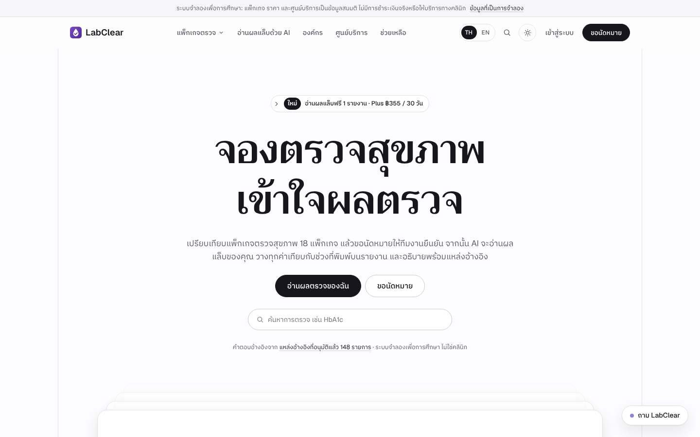
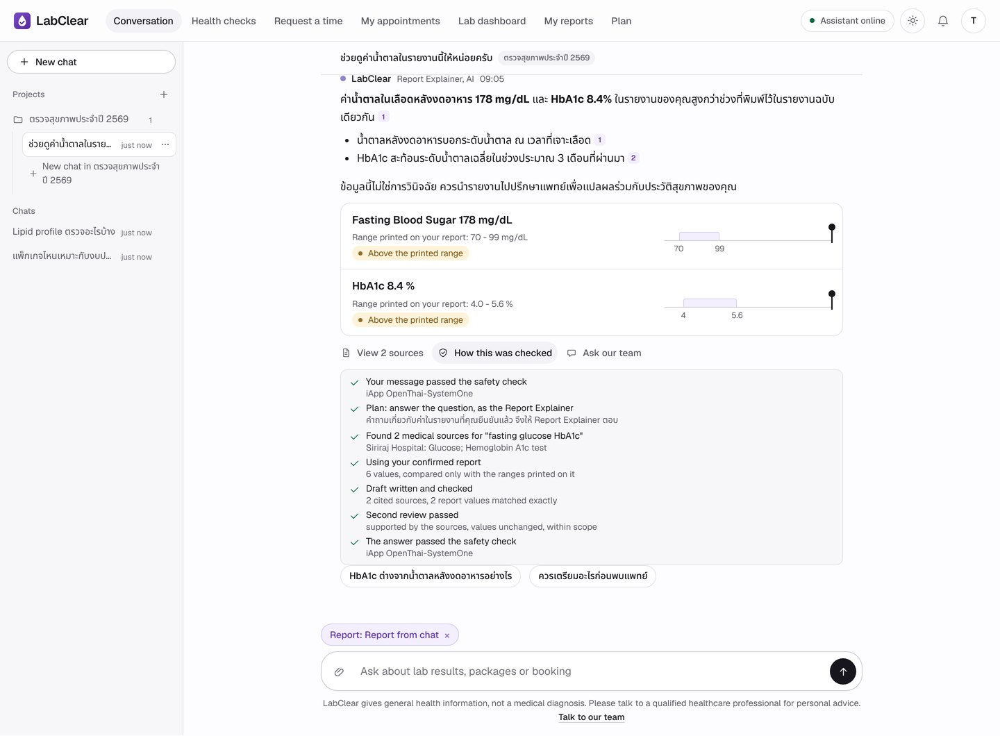
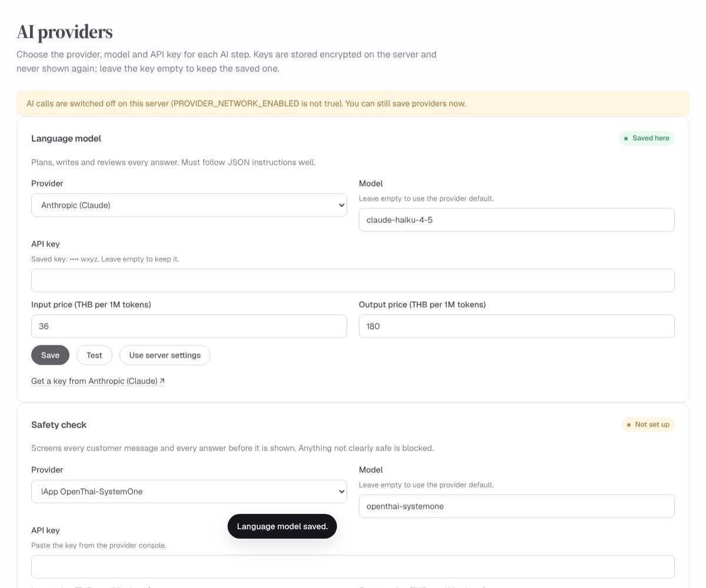

<div align="center">

<br>

<picture>
  <source media="(prefers-color-scheme: dark)" srcset="docs/assets/logo-dark.svg">
  
</picture>

<h3>Book the check. Understand the result.</h3>

<p>A Thai health-check assistant that recommends packages, books appointments<br>and explains lab reports — every answer backed by a cited source.</p>

<p>
  
  
  
  
  
</p>

<p>
  <a href="https://labclear.onrender.com"><b>Live demo</b></a> ·
  <a href="presentation/index.html"><b>Slides</b></a> ·
  <a href="docs/report/LabClear_Report.pdf"><b>Report</b></a> ·
  <a href="docs/deploy/render.md"><b>Deploy to Render</b></a> ·
  <a href="docs/deploy/vercel.md"><b>Deploy to Vercel</b></a>
</p>

<br>



</div>

<br>

## Highlights

<table>
<tr>
<td width="50%" valign="top">

**Grounded answers in Thai**<br>
<sub>BM25 retrieval over 58 reviewed medical sources with Thai aliases. Prices and policies come from the same files as the website, so the chat never invents them.</sub>

</td>
<td width="50%" valign="top">

**Lab reports in the chat**<br>
<sub>Attach a photo or PDF like in any chat app. LabClear reads every row, shows the values next to your image and explains them after one click to confirm.</sub>

</td>
</tr>
<tr>
<td valign="top">

**Shows its work**<br>
<sub>While it answers you see each step: safety check, plan and role, sources found, draft, second review, safety check. The steps stay under "How this was checked".</sub>

</td>
<td valign="top">

**Chats and projects**<br>
<sub>A chat list like Claude or ChatGPT: switch, rename and delete chats, and group them into projects such as a yearly check-up.</sub>

</td>
</tr>
<tr>
<td valign="top">

**Any AI provider, any safety model**<br>
<sub>Typhoon, OpenAI, Claude, Gemini, Hugging Face, OpenRouter, Grok, Kimi, Qwen, DeepSeek or any OpenAI-compatible API, screened by iApp OpenThai-SystemOne, TypeSafe Jev or Llama Guard 4.</sub>

</td>
<td valign="top">

**A real back office**<br>
<sub>Staff confirm bookings, reply to customers, issue quotations, run test payments and cap AI spending (call limit and a THB budget).</sub>

</td>
</tr>
</table>

<p align="center"><br>
<sub>Offline UI harness with a synthetic sample report</sub></p>

## Quick start

Requires **Python 3.12**.

```bash
git clone https://github.com/siriponsri/LabClear.git && cd LabClear
python -m venv .venv
source .venv/bin/activate                 # Windows: .venv\Scripts\activate
pip install -r requirements.txt
cp .env.example .env                      # Windows: copy .env.example .env
uvicorn main:app --port 8000
```

Open **<http://127.0.0.1:8000>**. On Windows you can simply double-click `START.bat`.

The website, catalog, booking and staff desk work straight away, with data in an encrypted SQLite file under `data/`.

### Demo accounts

Local runs come with three shared accounts. Sign in from the button at the top right.

| Username | Password | What it is |
|---|---|---|
| `test-01` | `1234` | Customer on the Free plan (one AI report reading) |
| `test-02` | `1234` | Customer with LabClear Plus (simulated) |
| `admin` | `1234` | Manager with full access; opens the service desk at `/staff` |

They are off on Render and Vercel unless you set `DEMO_ACCOUNTS=true`.

### Turn on the AI

1. Set `PROVIDER_NETWORK_ENABLED=true` in `.env` and restart.
2. Sign in as `admin` → **AI providers** (or create your own manager with `python scripts/create_staff.py --email you@example.com --role manager`).
3. Choose a provider for each step, paste its API key and press **Test**.

| Step | Default | Also supported |
|---|---|---|
| Language model | Typhoon `typhoon-v2.5-30b-a3b-instruct` | OpenAI · Claude · Gemini · Hugging Face · OpenRouter · Grok · Kimi · Qwen · DeepSeek · custom |
| Safety check | iApp OpenThai-SystemOne | TypeSafe Jev · Llama Guard 4 (OpenRouter) |
| Report reading | Typhoon OCR | OpenAI · Gemini · OpenRouter · custom |

Keys are stored encrypted in the database and never shown again. Prefer environment variables? Every setting has a fallback in [`.env.example`](.env.example).

<p align="center"></p>

## How it works

<p align="center"></p>

One web service (FastAPI, Jinja, vanilla JavaScript) serves the website, the customer workspace at `/app` and the staff desk at `/staff`. The chatbot pipeline searches the knowledge base and makes five AI calls per message, streaming each step to the page as it happens. Bookings, chats, provider settings and the spending cap live in PostgreSQL (SQLite locally), encrypted with Fernet. The full message flow is in [docs/assets/message-flow.png](docs/assets/message-flow.png).

## Tests

```bash
pip install -r requirements-dev.txt
python -m pytest -q                                    # 146 tests, no real AI calls
npm install && npx playwright install chromium
TEST_PYTHON=.venv/bin/python npm run uat               # 34 browser scenarios
python scripts/course_eval.py --base http://127.0.0.1:8000   # live evaluation (real AI)
```

## Project structure

```text
main.py              FastAPI app, security headers, pages
routers/             business API, chats and projects, staff API, AI provider settings, website
services/            chatbot pipeline, safety check, providers, RAG search, report reader, storage
templates/ static/   website and workspace UI (no build step)
knowledge/           58-source evidence catalog
business_data/       simulated packages, branches, policies, plans
examples/            six fictional Thai lab reports
docs/                deployment guides, report, diagrams
presentation/        reveal.js slides
```

## Documentation

| | |
|---|---|
| **Product** | [Business](docs/business.md) · [Customer journey](docs/customer-journey.md) · [Chatbot specification](docs/chatbot-spec.md) |
| **System** | [Architecture](docs/architecture.md) · [AI providers and agents](docs/ai-providers.md) · [Safety](docs/safety.md) · [API](docs/api.md) |
| **Quality** | [Testing](docs/testing.md) · [Team and progress](docs/team.md) |
| **Run it** | [Deploy to Render](docs/deploy/render.md) · [Deploy to Vercel](docs/deploy/vercel.md) |
| **Course** | [Final report (PDF)](docs/report/LabClear_Report.pdf) · [Slides](presentation/index.html) |
| **Data** | [Knowledge base](knowledge/README.md) · [Sample reports](examples/README.md) · [Notices](NOTICE.md) |

<br>

<sub>Built for 06048308 Intelligent Chatbot Development. Packages, prices, centers, payments and lab reports are simulated. LabClear gives general health information, not a diagnosis.</sub>
