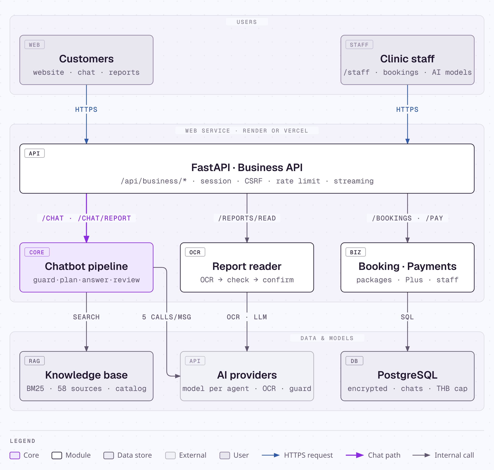
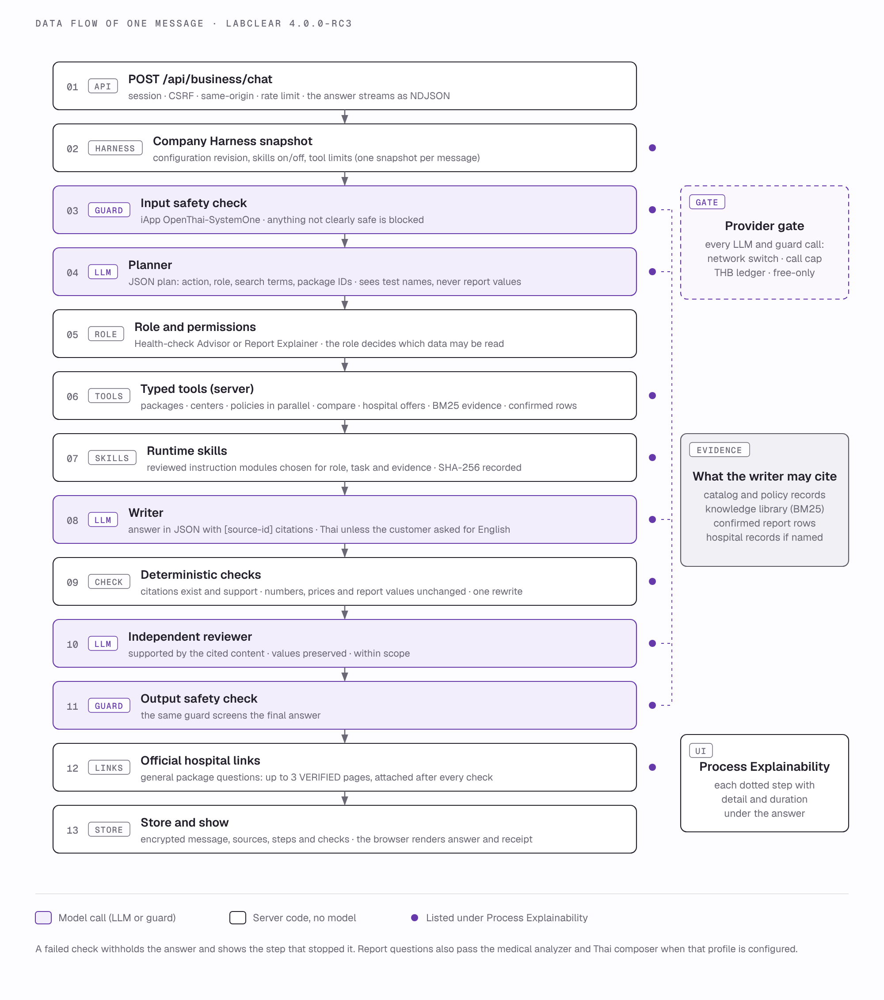

<!-- ceo-upgrade-20261008 -->

## Upgrade architecture

The [current flow diagram](ceo-upgrade/IMPLEMENTATION.md#request-flow) adds scoped
organization evidence and an optional typed analyzer/composer boundary before the
existing reviewer/guard. Organization documents reuse encrypted entities; runtime
instructions are fixed hash-checked files. No database table, worker platform or
deployment entrypoint is added. Acquisition metadata is outside active RAG.

## Integration 4.0 (rc1 web, rc2 free-first harness)

Hosting stays on **Render**: the unchanged API service (`render.yaml`, `scripts/run_business.py`) and an
optional second Render web service for the Thai-first TH/EN Next.js site in `web/`, which rewrites
`/api/*` and `/health` to the API; the API accepts that exact origin through `TRUSTED_ORIGINS`
([deploy/render-web.md](deploy/render-web.md)). Cloudflare Workers/Containers files are kept as a deferred
option; Cloudflare Free may later front the web service as DNS/proxy only.

The message pipeline is Codex's, with the free-first harness (rc2) inside it:

`session/CSRF/origin → input guard (regex pre-guard + System One) → planner (LLM proposes action, role,
search terms) → typed tools (services/agent_tools.py: lookup_packages, compare_packages, lookup_branches,
lookup_policies, retrieve_evidence = BM25 over the 58 reviewed sources, get_confirmed_report_rows,
preview_booking; scope = the role's server-defined reads/actions; strict inputs; timeout; output limit;
audit) → writer with per-task runtime skill modules (services/runtime_skills.select) → deterministic
validators (citations, prices, observations, content checks) → reviewer → output guard → UI`.

Every provider call goes through `conversation_transport.post_json`: free-only policy (only when
`FREE_ONLY_POLICY_PATH` is set by a trial server) → durable call cap → THB ledger → network. Retrieval is
BM25 only; no embedding API is called. OpenRouter roles (medical analyzer, Thai composer), DeepSeek,
Luna, Santé, Clef and embeddings are **DEFERRED_FOR_THIS_BENCHMARK**, not rejected or measured. Diagrams:
`docs/assets/architecture-4.0.png` and `docs/assets/message-flow-4.0.png`.

The 2026-10-08 upgrade is a disabled-by-default software candidate. Its current scope, evidence, configuration and remaining owner gates are recorded in the [upgrade index](ceo-upgrade/README.md). Earlier release counts and screenshots below are historical; they do not establish live model or clinical validation.

# Architecture

LabClear is one Python web service. It serves the public website, the customer workspace at `/app`, the service desk at `/staff` and a JSON API under `/api/business`. AI work runs inside the same service and calls external model providers over HTTPS.

## Components

| Layer | Component | Technology | Responsibility |
|---|---|---|---|
| Users | Customers | Browser | Website, chat with chats and projects, reports, bookings, payments |
| Users | Clinic staff and managers | Browser | Inbox, appointments, customers, payments, catalog, centers, roles, AI providers, budget, audit |
| Web | Website pages | Jinja templates, vanilla JavaScript, CSS | Catalog, comparison, centers, help, AI Lab Report, organizations, sign-in |
| Web | Workspace and service desk | `templates/workspace.html`, `static/js/workspace.js`, `static/js/turns.js` | Chat with live steps, report cards, chat list, booking, plans, staff tools |
| API | Business API | FastAPI routers in `routers/` | Sessions, CSRF and origin checks, rate limit, every business action |
| Core | Chatbot pipeline | `services/business_agent.py` | Safety → plan → search → write → validate → review → safety, streamed step by step |
| Core | Report reader | `services/report_reader_v2.py` | OCR → document safety check → rows → status from the printed range |
| Core | Safety check | `services/conversation_guard.py` | Pattern check and a safety model on messages, answers and documents |
| Core | Model transport | `services/conversation_transport.py`, `services/providers.py` | Provider per slot and per agent, call cap and THB ledger before every call |
| Data | Knowledge base | `knowledge/evidence/catalog.json`, `services/evidence_search.py` | BM25 over 58 reviewed sources with Thai aliases |
| Data | Business data | `business_data/*.json` | Catalog, centers, policies, plans, assistant roles |
| Data | Business store | `services/business_store.py` | One table of Fernet-encrypted entities in PostgreSQL (SQLite locally) |
| External | AI providers | Typhoon, OpenAI, Claude, Gemini, Hugging Face, OpenRouter, Grok, Kimi, Qwen, DeepSeek, custom; iApp OpenThai-SystemOne, TypeSafe Jev, Llama Guard 4; Typhoon OCR | Language model, safety model, report reading |
| Hosting | Render or Vercel | `render.yaml`, `vercel.json` | Deploys from GitHub; secrets in the dashboard |

## Routers

| Router | Prefix | Covers |
|---|---|---|
| `routers/site.py` | `/`, `/packages`, `/packages/{id}`, `/compare`, `/centers`, `/help`, `/lab-reports`, `/organizations`, `/sources`, `/privacy`, `/lab-report/{id}`, `/pay/sim/{id}` | Website pages |
| `routers/business.py` | `/api/business` | Session, sign-in, chat, reports, bookings, payments, plans, staff inbox |
| `routers/chats.py` | `/api/business/chats`, `/api/business/projects` | Chat list and projects |
| `routers/business_ops.py` | `/api/business` | Catalog search, notifications, quotations, LINE and payment simulators, staff dashboard |
| `routers/ai_admin.py` | `/api/business/staff/ai-providers` | Manager AI settings per slot and per agent |
| `routers/samples.py` | `/api/samples` | Synthetic sample reports |

The full endpoint list is in [api.md](api.md).

## How one message is processed

| Step | Where | Model call | Shown to the customer as |
|---|---|---|---|
| 1. The browser posts `/api/business/chat` with the session cookie, the CSRF token and `Accept: application/x-ndjson` | `routers/business.py` | — | "Sending" |
| 2. Session, origin, rate limit and optional access code are checked; the message is saved | `turn()` | — | — |
| 3. The call cap and the THB budget are checked before every model call | `conversation_transport.post_json` | — | — |
| 4. Pattern check, then the safety model screens the message | `conversation_guard.check(direction="input")` | 1 | "Your message passed the safety check" |
| 5. The planner chooses action, role, search terms and a reason | `business_agent.run` | 2 | "Plan: …, as the …" with the reason |
| 6. BM25 searches the knowledge base (with the test names in the message when the planner gives no terms); the role's business data is loaded | `evidence_search.search` | — | "Found n medical sources …" |
| 7. The writer drafts the answer with inline source IDs | `complete_json(Answer)` | 3 | "Writing the answer" |
| 8. Python removes links and HTML, then checks citations, report values, amounts against the catalog and the role's limits; a critical printed flag adds advice | `validate_answer`, `assert_no_sales` | — | "Draft written and checked" |
| 9. The reviewer checks support, values and scope | `complete_json(EvidenceReview)` | 4 | "Second review passed" |
| 10. The safety model screens the answer | `conversation_guard.check(direction="output")` | 5 | "The answer passed the safety check" |
| 11. The answer, its sources, any preview and the steps are saved; the result is streamed last | `turn()` | — | The answer replaces the steps |

Any failure stops the turn (fail closed): the message is marked "Not answered" with the reason and, when the failure is temporary, a Retry button. A reply that does not match the JSON contract gets one corrective retry, so a turn uses five calls normally and at most eight.

## A report sent in the chat

| Step | Model calls |
|---|---|
| The image or PDF (up to 3 pages, 3 MB each) is posted to `/api/business/chat/report` with the question | — |
| The reader transcribes each page (Typhoon OCR: one call per page) | 1–3 |
| The safety model screens the transcription as a document (hidden instructions, harmful content) | 1 |
| The language model turns the transcription into rows (Typhoon path) and the rows are screened again | 2 |
| Python computes within, above or below from the printed range; the card is shown | — |
| One click on "Values are correct, this is my report" confirms it and runs the normal turn above with the Report Explainer | 5 |

## Streaming

With `Accept: application/x-ndjson` the chat endpoints return one JSON object per line: `{"type":"step",…}` for each step as it starts and ends, then `{"type":"done","result":…}` or `{"type":"error",…}`. Without that header they return the plain JSON result, which the LINE worker and the tests use. If the browser disconnects the turn still finishes; Stop increases the chat version so a late answer is not added.

## Data model

Everything lives in one table, `rs_entities(id, kind, owner, state, branch, payload, created)`. The payload is JSON encrypted with Fernet using `BUSINESS_DATA_KEY`. A database-wide lock serializes state changes; model calls run outside the lock.

| Kind | Holds |
|---|---|
| `user`, `email`, `session` | Accounts (PBKDF2 passwords), sign-in index, sessions with CSRF token |
| `conversation`, `archive`, `project` | The active chat, other chats, projects |
| `report` | Uploaded reports: original image, rows, confirmation |
| `booking`, `action`, `ticket` | Appointment requests, previews awaiting confirmation, staff cases |
| `payment_txn`, `subscription` | Simulated payments and LabClear Plus periods |
| `configuration` | Catalog, centers, policies, roles and AI provider settings changed by managers |
| `notification`, `audit` | Customer and staff notifications, audit log |

## Deployment

| Host | File | Notes |
|---|---|---|
| Render | [`render.yaml`](../render.yaml) | Web service plus managed PostgreSQL; free plan sleeps after 15 idle minutes. Guide: [deploy/render.md](deploy/render.md) |
| Vercel | [`vercel.json`](../vercel.json) | One function, 120 s limit, Neon PostgreSQL. Guide: [deploy/vercel.md](deploy/vercel.md) |
| Local | `.env` from `.env.example` | SQLite in `data/`, a generated key, demo accounts on |

A hosted run refuses to start business features without a PostgreSQL `DATABASE_URL` and a `BUSINESS_DATA_KEY`.
