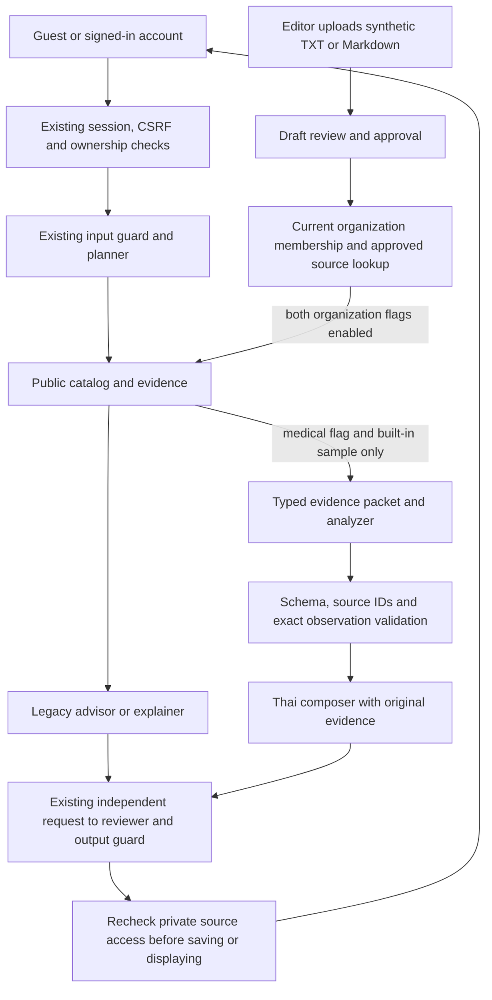

# Implementation and boundaries

## Request flow



All provider requests retain the existing network switch, call counter and atomic
cost reservation. Runtime skills load only fixed, hash-checked modules. No runtime
code loads development skills, arbitrary user paths, shell commands or uploaded instructions.

## Organization references

Storage reuses encrypted `rs_entities` with kind `organization_source`; no table or
migration is added. A manager assigns an existing registered user to one organization
and a reader/editor role. Editors upload and review; readers see approved documents.
Guest sessions cannot participate. Membership comes from the authenticated user,
never the upload or query. Global managers can provision membership across organizations;
this is an administrative trust boundary, not delegated tenant self-administration.

Only UTF-8 TXT/Markdown up to 256 KiB is accepted. Paths, binary controls and empty
files are rejected. At most 100 source records per organization, including tombstones.
SHA-256 deduplication is scoped to the organization. Approval records reviewer/time;
atomic replacement revokes the old version. Revocation hides retrieval and download
immediately on the next request. Deletion strips stored text and filename while retaining
provenance. Search is token overlap over approved lines, not vector retrieval or a
clinical ranking algorithm. Excerpts carry source ID, version, line and file hash.

Old assistant turns derived from private references are excluded from later model
context after revoke, membership loss or feature disable. Private source IDs are
tracked even when a model omits citations, and rechecked after generation. Previously
displayed or downloaded text cannot be recalled; account chat history remains an
account record. Real documents require G-DATA and an agreed retention policy.

| Method | `/api/business/organization-documents` suffix | Access / effect |
|---|---|---|
| GET | empty | Member metadata list; editors also see lifecycle states |
| PUT | `/membership` | Manager; registered user ID, organization ID, role |
| POST | empty | Editor multipart `file`, `title`, optional `previous_id` |
| POST | `/search` | Member JSON `q`; query not placed in access-log URL |
| GET | `/{id}` | Approved source or editor draft/rejected preview |
| GET | `/{id}/download` | Approved source only, plain text attachment |
| POST | `/{id}/{action}` | Editor approve/reject/revoke/delete |

API responses use the existing no-store middleware and mutation CSRF checks.
The browser uses textContent, no HTML rendering of document content, no persistent
browser document cache. Download filenames are fixed.

## Models and guards

Four legacy agent roles retain shared/saved provider behavior. Two new roles,
`medical_analyzer` and `thai_composer`, are disabled until explicitly configured.
Their OpenRouter settings require exact model, both prices and endpoint allowlist;
requests forbid fallback, require zero-data-retention routing and deny data collection.
Those request controls still require owner verification of endpoint support/policy.
The private-reference path preflights every configured pipeline role and rejects free endpoints.

The medical path currently accepts only the built-in confirmed sample report.
Other reports fail closed while G-DATA/clinical calibration remain pending. The
analyzer copies raw values, units and printed reference intervals exactly. Claims
must cite supplied source/observation IDs. A composer receives the validated analysis
plus original evidence; the existing reviewer still receives the original context.
Schema and numeric fidelity do not establish semantic or medical correctness.

Santé requests omit unsupported `response_format`; JSON is parsed and validated
in Python. The normal analyzer rejects `:free` models. The analyzer helper supports
at most two attempts through trusted explicit role arguments; the application does
not automatically enable paid fallback. Cancellation propagates. Existing iApp,
Llama Guard, Typhoon OCR and chat adapters remain; Clef and embeddings have metadata
only and no active new adapter. Clef input coverage, thresholds, policy calibration,
quotas and account pricing remain unverified; selecting its ID as ordinary chat
does not implement its typed API. No multi-guard voting or deny-shopping is introduced.

`GuardDecision` provides a strict normalization contract and rejects incomplete
coverage as ALLOW. It is an offline boundary for future guard adapters, not a claim
that every legacy guard now returns that type. Provider-specific circuit breakers,
new embeddings/hybrid retrieval and clinically calibrated semantic evaluation are
remaining work, not hidden defaults.

## UI and offers

`/preview/landing` is separate from `/`. The brief preserves the current purple
palette and fonts, uses Thai first, a keyboard-operable synthetic report explorer,
unchanged values across TH/EN, an external educational citation and existing CTAs.
The report figures are illustrative, not personal reference ranges. G-UI is required
before expanding this design to the product. Preview timings include fixture
navigation and screenshots and are not production performance measurements.

`/hospital-links` contains official external links only. No hospital logo, booking
integration or partnership is claimed. Price, variant, branch, sale and service
dates remain separate; unknowns stay unknown. Offers are not injected into clinical
RAG or the simulated appointment system. A future package-to-test mapping needs
reviewed inclusions and clinical appropriateness; this candidate does not guess one.

## Verification commands

Run from the repository root with installed pinned development dependencies:

```powershell
rtk proxy .venv/Scripts/python.exe scripts/offline_check.py pytest -q --junitxml=docs/ceo-upgrade/evidence/candidate-pytest.xml
rtk proxy node tests/browser/uat.cjs
rtk proxy node tests/browser/upgrade.cjs
rtk proxy .venv/Scripts/python.exe scripts/offline_check.py evaluation
```

The runner removes inherited app credentials, imports config outside the repository
so `.env` is not loaded, uses a temporary DB/key and denies outbound sockets.
Only Windows asyncio's internal socketpair connection is exempt. Browser fixtures
use synthetic accounts, provider/OCR doubles and local HTTP. Never run a normal
production-configured test command as a substitute. Preview manually with
`rtk proxy .venv/Scripts/python.exe scripts/offline_check.py browser 8099` and open
`http://127.0.0.1:8099/preview/landing`; this is a synthetic fixture, not a live demo.

`rtk proxy .venv/Scripts/python.exe scripts/offline_check.py boot` runs the unchanged
Render entry point with dotenv suppressed and isolated storage. It starts/stops real
Uvicorn and checks eight ASGI routes; it does not connect to production PostgreSQL.

Guest signup/sign-in also clears the previous identity's messages/report context
before closing the dialog. A workspace response captured under an older user ID or
Guest token is discarded. UI-33 holds an old Guest poll across signup to verify this.
