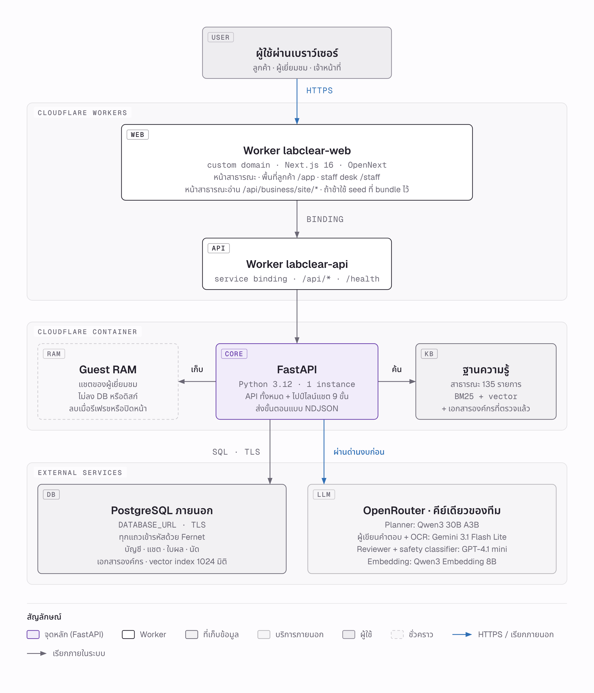
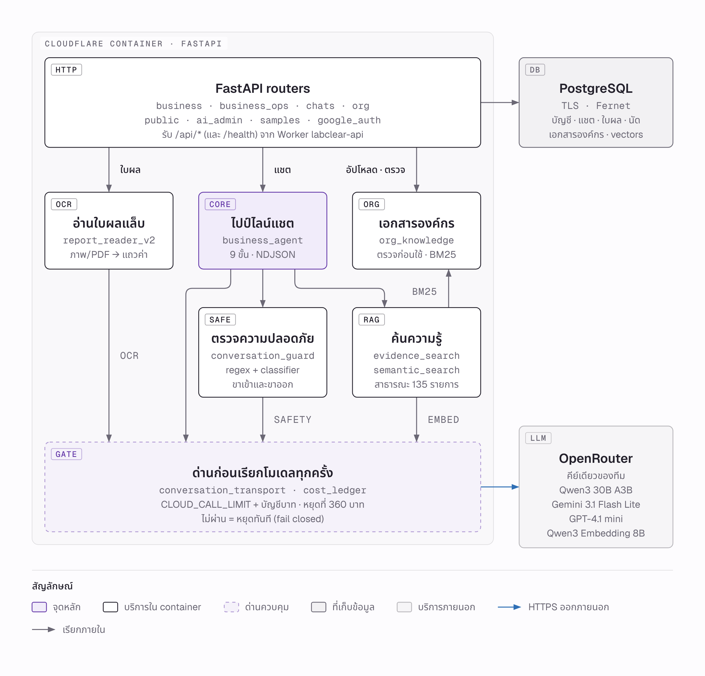
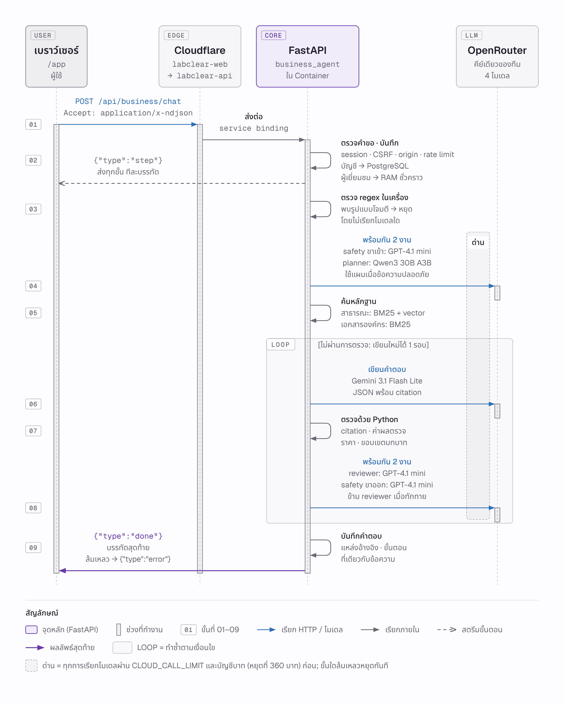

# LabClear 4.0.0 รายงานทางเทคนิค

**วิชา** 06048308 Intelligent Chatbot Development · Final Project

**ผู้พัฒนา** นายวัชรินทร์ บัวสอน (68076055) · นายศิริพล ศรีเฮงไพบูลย์ (68076060)

**รุ่น** 4.0.0 ต่อจาก 3.1.0 · **วันที่** 8 ตุลาคม 2569

> รายงานนี้อธิบายการออกแบบ การตัดสินใจ และหลักฐานของรุ่น 4.0.0 ข้อเท็จจริงทั้งหมดอ้างอิง [release-4.0.0.md](../release-4.0.0.md) และโค้ดใน repository ระบบยังไม่ได้ deploy ขึ้นบัญชี Cloudflare ของทีม และยังไม่เคยเรียกโมเดลบน OpenRouter ด้วยคีย์จริง ตัวเลขค่าใช้จ่ายในรายงานจึงเป็นค่าประมาณ ไม่ใช่ผลวัด

## 1. สรุป

LabClear เป็นแชตบอตของคลินิกตรวจสุขภาพจำลอง ลูกค้าถามเรื่องแพ็กเกจ ราคา และการนัดหมายได้ ส่งภาพใบผลแล็บให้ AI อ่าน ยืนยันค่า แล้วได้คำอธิบายภาษาไทยพร้อมแหล่งอ้างอิง ส่วนเจ้าหน้าที่ใช้หน้า `/staff` ยืนยันนัด ตอบลูกค้า ออกใบเสนอราคา และคุมงบ AI

รุ่น 4.0.0 ตอบความเห็นของ CEO 5 ข้อหลังการนำเสนอความก้าวหน้า

| ข้อ | ความเห็น CEO | สิ่งที่เปลี่ยน |
|---|---|---|
| 1 | แหล่งอ้างอิงน้อยและเจาะจงบางโรงพยาบาล อยากให้ลูกค้าองค์กรอัปโหลดเอกสารของโรงพยาบาลเองได้ | ฐานความรู้สาธารณะจาก 58 เป็น 135 รายการจาก 24 ผู้เผยแพร่ และระบบเอกสารอ้างอิงขององค์กรที่เจ้าหน้าที่ตรวจก่อนใช้ |
| 2 | ถ้าไม่ได้เข้าสู่ระบบ ประวัติแชตหายเมื่อรีเฟรช | เจ้าของโครงการเลือกให้ล้างทุกครั้งเพื่อความเป็นส่วนตัว รุ่นนี้ทำให้พฤติกรรมนี้ชัดและแน่นขึ้น และให้เลือกเก็บแชตตอนเข้าสู่ระบบได้ |
| 3 | ย้ายจาก Render ไป Cloudflare บนโดเมนที่ทีมซื้อไว้ | Worker หน้าเว็บ + Worker API ที่รัน FastAPI ใน Cloudflare Container เชื่อมด้วย service binding บน origin เดียว |
| 4 | ใช้ OpenRouter key ของทีมเป็นหลัก เลือกโมเดลถูก ดี เร็ว งบ USD 10 และพิจารณา embedding | ทุกขั้นใช้คีย์เดียว: Qwen3 30B, Gemini 3.1 Flash Lite, GPT-4.1 mini, Qwen3 Embedding 8B ประมาณ USD 0.008 ต่อคำตอบ งบในระบบ 360 บาท |
| 5 | หน้าเว็บเน้นภาษาไทย ใช้ Next/React/Three ได้ ให้เด่นและเข้าใจง่าย | ย้ายทั้งเว็บไป Next.js 16 + React 19 + React Three Fiber ภาษาไทยเป็นค่าเริ่มต้น |

หลักฐานที่มีตอนนี้: pytest ผ่าน 261 ข้อ, browser UAT บนเว็บ Next.js 51 สถานการณ์ ผ่าน 49 ไม่ผ่าน 2, type check และการตรวจคำแปลไทยผ่าน, build และ dry-run ของ Cloudflare ผ่าน ทั้งหมดใช้โมเดลจำลอง คุณภาพคำตอบจริงยังต้องวัดหลัง deploy

## 2. ธุรกิจและขอบเขต

LabClear จำลองคลินิกตรวจสุขภาพขนาดเล็กที่มี 3 ศูนย์ (กรุงเทพฯ อารีย์ เชียงใหม่ สุเทพ ขอนแก่น) เปิดจันทร์–เสาร์ 07:00–16:00 น. ขายสองอย่าง

- **แพ็กเกจตรวจสุขภาพ 18 รายการ** แพ็กเกจหลัก 4 รายการจองได้ทันที (เริ่ม ฿1,190) การตรวจติดตาม 11 รายการต้องให้ทีมงานพิจารณาก่อน และแพ็กเกจองค์กร 3 รายการสำหรับ 20 คนขึ้นไป
- **AI Lab Report** แผนฟรีอ่านผลได้ 1 รายงาน แผน Plus ฿355 ต่อ 30 วัน อ่านได้ไม่จำกัดและดูผลย้อนหลัง

ข้อมูลธุรกิจ ราคา การชำระเงิน และใบผลแล็บทั้งหมดเป็นข้อมูลสมมติ แชตบอตต้องตอบจากแค็ตตาล็อก นโยบาย และฐานความรู้ที่ตรวจแล้วเท่านั้น ห้ามวินิจฉัย ห้ามสั่งยาหรือบอกขนาดยา ห้ามแต่งราคาหรือส่วนลด และห้ามเปิดเผยข้อมูลลูกค้าคนอื่น การจอง การชำระ และการคืนเงินเกิดขึ้นหลังลูกค้ากดยืนยันและเจ้าหน้าที่ตรวจเท่านั้น รายละเอียดอยู่ใน [business.md](../business.md) และ [chatbot-spec.md](../chatbot-spec.md)

## 3. การออกแบบระบบ

### 3.1 องค์ประกอบ

| ชั้น | องค์ประกอบ | หน้าที่ |
|---|---|---|
| Edge | Worker `labclear-web` (Next.js 16 ผ่าน OpenNext) | รับทุก request บนโดเมนของทีม หน้าสาธารณะเป็น server component ส่วน `/app` และ `/staff` เป็น client component |
| Edge | `web/worker.ts` | ส่ง `/api/*` และ `/health` ไปที่ service binding `API` ที่เหลือส่งให้ Next.js |
| Edge | Worker `labclear-api` | ไม่มี hostname สาธารณะ ตั้ง header `X-Forwarded-*` แล้วส่งเข้า container ชื่อ `labclear-primary` |
| API | FastAPI (Python 3.12) ใน Cloudflare Container หนึ่ง instance | session, CSRF, origin, rate limit และทุกการทำงานทางธุรกิจ |
| Core | `business_agent`, `conversation_guard`, `report_reader_v2`, `conversation_transport` | pipeline ของแชต การตรวจความปลอดภัย การอ่านใบผล และการเรียกโมเดลผ่านด่านจำนวนครั้งและงบเงิน |
| Data | `knowledge/evidence/catalog.json` | ฐานความรู้สาธารณะ 135 รายการ ค้นด้วย BM25 และ vector |
| Data | `org_knowledge` | เอกสารขององค์กรที่ผ่านการตรวจ ค้นด้วย BM25 เฉพาะสมาชิก |
| Data | PostgreSQL ภายนอก | ตาราง `rs_entities` ทุกแถวเข้ารหัส Fernet ด้วย `BUSINESS_DATA_KEY` |
| External | OpenRouter | คีย์เดียวของทีมสำหรับทุกโมเดล |

ภายใน container router ส่งแชตให้ pipeline ส่งใบผลให้ตัวอ่าน และส่งไฟล์ขององค์กรให้บริการเอกสารองค์กร ทุกส่วนที่เรียกโมเดลต้องผ่านด่านเดียวกันก่อนถึง OpenRouter

### 3.2 หนึ่ง origin สำหรับหน้าเว็บและ API

ทีมเลือกให้หน้าเว็บและ API อยู่บนโดเมนเดียวกัน เพราะ API เดิมพึ่ง cookie `labclear_session` แบบ HttpOnly + SameSite=Strict, CSRF header และการตรวจ header `Origin` ถ้าแยกโดเมน ต้องเปิด CORS แบบมี credential และเปลี่ยน cookie เป็น SameSite=None ซึ่งเพิ่มช่องให้โจมตีข้ามไซต์ การใช้ service binding ทำให้ request จากเบราว์เซอร์ไปถึง FastAPI พร้อม URL เดิม FastAPI จึงเห็น host สาธารณะและตรวจ Origin ได้เหมือนตอนรันในเครื่อง ตอนพัฒนาในเครื่อง `next.config.ts` rewrite `/api` ไปที่ `http://127.0.0.1:8000` และ FastAPI ยอมรับ origin `http://localhost:3000` ผ่าน `TRUSTED_ORIGINS`

### 3.3 ข้อมูล

ข้อมูลถาวรทุกชนิดอยู่ในตารางเดียว `rs_entities(id, kind, owner, state, branch, payload, created)` โดย `payload` เป็น JSON ที่เข้ารหัส Fernet ชนิดใหม่ในรุ่นนี้คือ `organization`, `org_code` (ดัชนีรหัสเข้าร่วมแบบ hash), `org_member`, `org_doc` และแถว `configuration_embedding_index` ที่เก็บ vector index

ข้อมูลของผู้เยี่ยมชม (ข้อความ ภาพ ผลอ่านใบผล) ไม่ลง PostgreSQL เลย อยู่ใน RAM ของ process Python เดียว ด้วยเหตุนี้ container จึงตั้ง `max_instances: 1` และ `WEB_CONCURRENCY=1` ถ้ามีหลาย instance คำขอต่อเนื่องของผู้เยี่ยมชมคนเดียวอาจไปตกคนละเครื่องและหาแชตไม่เจอ

ตอนเริ่ม container `scripts/container_start.py` ตรวจว่า `DATABASE_URL` เป็น PostgreSQL ที่ใช้ `sslmode=require` ขึ้นไป ตรวจรูปแบบคีย์ และลองถอดรหัสแถวแรกในฐาน ถ้าคีย์ไม่ตรงกับข้อมูลจะหยุดก่อนรับ traffic

## 4. ข้อความหนึ่งข้อความเดินทางอย่างไร

1. เบราว์เซอร์ POST `/api/business/chat` พร้อม `Accept: application/x-ndjson` ผ่าน Worker หน้าเว็บและ service binding ไปถึง container
2. ตรวจ session, CSRF, origin และ rate limit แล้วบันทึกข้อความ (บัญชีลง PostgreSQL ผู้เยี่ยมชมลง RAM)
3. ตรวจรูปแบบการโจมตีในเครื่องด้วย regex ภาษาไทยและอังกฤษ ถ้าพบจะหยุดโดยไม่เรียกโมเดลใดเลย
4. **พร้อมกัน:** safety classifier ขาเข้า (GPT-4.1 mini) และ planner (Qwen3 30B) แผนจะถูกใช้ก็ต่อเมื่อข้อความผ่านการตรวจ
5. ค้นความรู้: BM25 + vector บนฐานสาธารณะ และ BM25 บนเอกสารขององค์กรที่แชตนี้เลือก
6. ผู้เขียนคำตอบตามบทบาท (Gemini 3.1 Flash Lite) เขียน JSON พร้อมรหัสแหล่งอ้างอิง
7. Python ตรวจ citation ค่าผลตรวจ จำนวนเงินเทียบแค็ตตาล็อก และขอบเขตของบทบาท แก้ได้หนึ่งรอบ
8. **พร้อมกัน:** reviewer (GPT-4.1 mini) และ safety classifier ขาออก ข้าม reviewer เมื่อเป็นคำทักทายหรือคำถามกลับที่ไม่มีข้อเท็จจริงหรือแหล่งอ้างอิง
9. บันทึกคำตอบ แหล่งอ้างอิง และขั้นตอน แล้วส่งผลลัพธ์เป็นบรรทัดสุดท้ายของ stream

ทุกการเรียกโมเดลต้องผ่านเพดานจำนวนครั้ง (`CLOUD_CALL_LIMIT`) และบัญชีค่าใช้จ่ายบาท (`PROJECT_BUDGET_THB`) ก่อนเสมอ ขั้นใดล้มเหลว ระบบหยุดและแสดงสาเหตุพร้อมปุ่มลองใหม่ (fail closed) ระหว่างรอ ลูกค้าเห็นแต่ละขั้นแบบ stream และขั้นเหล่านี้ยังดูย้อนหลังได้ใต้คำตอบในหัวข้อ "ตรวจสอบคำตอบนี้อย่างไร"

การอ่านใบผลในแชตใช้ Gemini 3.1 Flash Lite หนึ่งครั้งอ่านทุกหน้าและคืนเป็นแถวค่า JSON จากนั้น safety classifier ตรวจข้อความที่อ่านได้และตรวจแถวค่าอีกครั้งในฐานะ "เอกสาร" (มองหาคำสั่งที่ซ่อนถึง AI ไม่ใช่ข้อมูลสุขภาพของลูกค้าเอง) Python คำนวณว่าค่าอยู่ใน สูงกว่า หรือต่ำกว่าช่วงที่พิมพ์บนใบผล แล้วรอให้ลูกค้ากด "ค่าถูกต้อง นี่คือรายงานของฉัน" ก่อนอธิบาย

## 5. การตัดสินใจตามความเห็น CEO

### 5.1 แหล่งอ้างอิงและเอกสารขององค์กร (ข้อ 1)

**สิ่งที่ทำ** เพิ่มฐานความรู้สาธารณะเป็น 135 รายการ แบ่งเป็นหน่วยงานรัฐไทย 5 สมาคมวิชาชีพไทย 13 ห้องแล็บโรงพยาบาลไทย 49 หน่วยงานสากล 27 และแหล่งอ้างอิงสากล 41 ทุกการตรวจในแค็ตตาล็อกมีอย่างน้อยสองผู้เผยแพร่ แต่ละรายการมีชื่อไทยแบบที่คนทั่วไปใช้ (เช่น น้ำตาลสะสม ไขมันเลว ค่าไต) เพื่อให้คำถามภาษาไทยค้นเจอเอกสารภาษาอังกฤษ

ส่วนความต้องการเอกสารเฉพาะโรงพยาบาล ทีมทำเป็นระบบ **เอกสารอ้างอิงขององค์กร**

| ขั้น | ผู้ทำ | รายละเอียด |
|---|---|---|
| สร้างองค์กร | ผู้จัดการ LabClear | ได้รหัสเข้าร่วมรูปแบบ `ABCD-2345` เก็บในฐานเป็น hash |
| เข้าร่วม | ลูกค้าที่มีบัญชี | กรอกรหัสที่ `/app` → องค์กรของฉัน (ไม่เกิน 5 องค์กรต่อบัญชี) |
| ตั้งผู้ดูแล | ผู้จัดการ LabClear | กำหนดสมาชิกบางคนเป็นผู้ดูแลองค์กร ซึ่งอัปโหลดได้ |
| อัปโหลด | ผู้ดูแลองค์กร | PDF ที่มีชั้นข้อความ, DOCX, TXT หรือ MD ไม่เกิน 5 MB เซิร์ฟเวอร์แปลงเป็นข้อความ ตัดเป็นช่วงละประมาณ 900 ตัวอักษร ตรวจทุกช่วงหาข้อความที่สั่ง AI แล้วเก็บแบบเข้ารหัสในสถานะ `pending` ไม่เก็บไฟล์ต้นฉบับ |
| ตรวจ | ผู้จัดการ LabClear | อ่านทุกช่วงที่ `/staff` → ตรวจเอกสารอ้างอิง อนุมัติหรือไม่อนุมัติ ถ้ามีช่วงที่ถูกทำเครื่องหมาย ต้องเขียนหมายเหตุก่อนอนุมัติ และช่วงนั้นไม่ถูกใช้ |
| ใช้ในแชต | สมาชิก | เลือกองค์กรให้แชต (`/chat/org-scope`) ช่วงที่อนุมัติแล้วถูกค้นด้วย BM25 และอ้างอิงโดยระบุชื่อองค์กรเป็นผู้เผยแพร่ |

**ทางเลือกและ trade-off**

- *ให้ AI อนุมัติเอกสารเอง* เร็วกว่าแต่เปิดทางให้เอกสารที่ฝังคำสั่งหรือข้อมูลผิดเข้าสู่คำตอบทางการแพทย์ ทีมเลือกให้คนตรวจทุกฉบับ ต้นทุนคือเอกสารใหม่ใช้ไม่ได้ทันที
- *ส่งเอกสารองค์กรไปทำ embedding* จะค้นด้วยความหมายได้ดีขึ้น แต่ต้องส่งเนื้อหาขององค์กรไปยังผู้ให้บริการภายนอก ทีมเลือก BM25 อย่างเดียวเพื่อให้เนื้อหาไม่ออกจากเซิร์ฟเวอร์ ข้อเสียคือคำถามที่ใช้คำต่างจากเอกสารอาจค้นไม่เจอ
- *ไม่เก็บไฟล์ต้นฉบับ* ลดข้อมูลที่ต้องดูแล แต่ PDF ที่สแกนเป็นภาพ (ไม่มีชั้นข้อความ) จะถูกปฏิเสธ ผู้ดูแลต้อง export จาก Word หรือ Google Docs

**สิ่งที่ยังค้าง** แหล่งอ้างอิงใหม่ 77 รายการเขียนจากความรู้โดยไม่ได้เปิดเว็บ เพราะสภาพแวดล้อมที่ใช้พัฒนาไม่มีอินเทอร์เน็ต ทุกรายการติด `verification.url_checked=false` ต้องรัน `python scripts/verify_sources.py` จากเครื่องที่ออกอินเทอร์เน็ตได้ แล้วให้คนอ่านเทียบเนื้อหากับหน้าเว็บจริง ร่าง 13 รายการของโรงพยาบาลที่ไม่มีลิงก์บทความเฉพาะ (รามาธิบดี จุฬาลงกรณ์ มหาราชนครเชียงใหม่ สงขลานครินทร์ ราชวิถี) ถูกแยกไว้ใน `knowledge/evidence/pending.json` และไม่ถูกค้น เพราะอาจทำให้ระบบอ้างว่าโรงพยาบาลพูดสิ่งที่ไม่เคยเผยแพร่

### 5.2 ประวัติแชตของผู้เยี่ยมชม (ข้อ 2)

ความเห็นนี้มีสองทางแก้ที่ขัดกัน: เก็บแชตไว้ในเบราว์เซอร์ให้ยังอยู่หลังรีเฟรช หรือคงการล้างไว้เพื่อความเป็นส่วนตัว คำถามเรื่องผลตรวจเป็นข้อมูลสุขภาพ และคอมพิวเตอร์ที่ใช้ร่วมกันจะเปิดให้คนถัดไปเห็นได้ เจ้าของโครงการจึงเลือก **ล้างทุกครั้งที่รีเฟรช** งานในรุ่นนี้คือทำให้ผู้ใช้รู้และควบคุมได้

| กลไก | ที่อยู่ในโค้ด |
|---|---|
| token ของผู้เยี่ยมชมอยู่ในหน่วยความจำของหน้าเท่านั้น ไม่ใช้ localStorage, sessionStorage, IndexedDB หรือ cookie | `web/lib/api/client.ts` |
| เมื่อปิดหรือรีเฟรช เบราว์เซอร์ส่ง beacon ไป `/api/business/guest/close` ให้เซิร์ฟเวอร์ลบข้อมูลใน RAM ทันที | `client.ts`, `routers/business.py` |
| หน้าที่กลับมาจาก back/forward cache ถูกโหลดใหม่ แชตเก่าจึงไม่โผล่ | `client.ts` (`pageshow`) |
| แถบ "โหมดผู้เยี่ยมชม" อยู่เหนือช่องพิมพ์ตลอด และเบราว์เซอร์ถามก่อนออกจากหน้าที่มีข้อความ | `web/components/chat/guest.tsx` |
| ตอนเข้าสู่ระบบหรือสมัคร เลือก "เก็บแชตนี้ไว้ในบัญชีของฉัน" ได้ ถ้าไม่เลือก แชตถูกลบ | `adopt_guest_chat` ใน `routers/business.py` |
| ผู้เยี่ยมชมที่ไม่ใช้งาน 20 นาที หรือ container restart ข้อมูลหาย | `services/guest_memory.py` |

**trade-off** ผู้ใช้ที่เผลอกดรีเฟรชจะเสียแชต ทีมลดความเสี่ยงด้วยกล่องถามก่อนออกจากหน้าและทางเลือกเก็บแชตเมื่อเข้าสู่ระบบ หลักฐานคือ pytest สองข้อใน `test_release_400.py` และ UAT R4-02, R4-03, R4-04 ที่ผ่าน

### 5.3 ย้ายไป Cloudflare (ข้อ 3)

| ทางเลือก | ข้อดี | เหตุที่ไม่เลือก |
|---|---|---|
| ย้าย FastAPI ทั้งหมดไป Python Workers | ไม่ต้องมี container | ใช้ `psycopg`, `pypdfium2`, Pillow, cryptography ต้องตรวจทีละแพ็กเกจ และ RAM ของผู้เยี่ยมชมต้องการ process ที่อยู่ต่อเนื่อง |
| Worker เดียวส่งทุกอย่างเข้า container ที่รันทั้งหน้าเว็บและ API (แผนวันที่ 7 ต.ค.) | ง่ายที่สุด | หน้าเว็บย้ายเป็น Next.js แล้ว และหน้าสาธารณะจะช้าทุกครั้งที่ container หลับ |
| ฐานข้อมูล D1 บน Cloudflare | อยู่บน Cloudflare ทั้งหมด | ใช้ SQLite semantics ต้องเขียน adapter และย้ายข้อมูลเพิ่ม เปลี่ยนแค่ `DATABASE_URL` ไม่ได้ |
| **สอง Worker + Container + PostgreSQL ภายนอก (เลือก)** | หน้าเว็บตอบจาก edge, API เดิมไม่ต้องแก้สัญญา, origin เดียว | ต้องมี Workers Paid และ Docker ตอน deploy มีสองโปรเจกต์ให้ build |

หน้าเว็บสาธารณะอ่าน `/api/business/site/*` ผ่าน binding โดยรอไม่เกิน 2.5 วินาที ถ้า container ยังไม่ตื่นจะใช้ข้อมูล seed ที่ bundle ไว้ หน้าเว็บจึงไม่ค้างแม้ container หลับหลังไม่มี request 25 นาที ส่วนแชตและการจองต้องรอ container ตื่น ซึ่งยังไม่ได้วัดเวลาบน Cloudflare จริง

การ deploy มีสามทาง: `scripts/deploy-cloudflare.sh --deploy`, `scripts/Deploy-LabClearCloudflare.ps1 -Deploy` และ GitHub Actions ที่ deploy เมื่อตั้ง `CLOUDFLARE_DEPLOY=true` ทุกทาง deploy API ก่อนเว็บ และส่ง commit ปัจจุบันให้ `/health` แสดง ตั้งโดเมนด้วย `npm run cf:domain -- labclear.<โดเมน>`

### 5.4 โมเดลและงบ USD 10 (ข้อ 4)

ทุกขั้นใช้คีย์ OpenRouter เดียวของทีม

| ขั้น | โมเดล | เหตุผล |
|---|---|---|
| Planner | `qwen/qwen3-30b-a3b-instruct-2507` | MoE ที่ active ราว 3B ตอบ JSON สั้นได้เร็วและถูกที่สุดในชุด |
| ผู้เขียนคำตอบ (Advisor, Explainer) และ OCR | `google/gemini-3.1-flash-lite` ปิด reasoning | เร็ว ภาษาไทยดี ราคาต่ำ และรับภาพได้จึงใช้อ่านใบผลด้วย |
| Reviewer และ safety classifier | `openai/gpt-4.1-mini` | ต่างตระกูลจากผู้เขียน และกำหนด label เองได้ว่าการอธิบายช่วงค่าบนใบผลถือว่าปลอดภัย ซึ่ง Llama Guard ทำไม่ได้เพราะหมวด S6 ตายตัว |
| Embedding | `qwen/qwen3-embedding-8b` ตัดเหลือ 1024 มิติ | ราคาต่ำสุดในกลุ่มและรองรับหลายภาษา |

ค่าใช้จ่ายโดยประมาณต่อคำตอบ จากราคา snapshot วันที่ 7 ต.ค. 2569

| ขั้น | โมเดล | tokens ที่สมมติ (เข้า/ออก) | USD |
|---|---|---|---|
| Planner | Qwen3 30B A3B (0.048/0.193 ต่อล้าน) | 7,000 / 300 | 0.0004 |
| เขียนคำตอบ | Gemini 3.1 Flash Lite (0.25/1.50) | 6,000 / 1,200 | 0.0033 |
| Reviewer | GPT-4.1 mini (0.40/1.60) | 7,000 / 50 | 0.0029 |
| Safety ×2 | GPT-4.1 mini | 1,500 / 10 ต่อครั้ง | 0.0012 |
| Embedding query | Qwen3 Embedding 8B (0.01) | ~30 | ~0 |
| **รวม** | | | **≈ 0.008** |

งบ USD 10 จึงพอประมาณ 1,250 คำตอบ คำทักทายถูกกว่าเพราะไม่มี reviewer อ่านใบผล 1 หน้าประมาณ USD 0.002 บวกคำอธิบายอีกประมาณ 0.008 การสร้าง vector index ครั้งเดียวใช้ราว 60k tokens น้อยกว่า USD 0.001 ระบบเก็บ index แบบเข้ารหัสในฐานข้อมูล container ที่ restart จึงไม่ต้องจ่ายซ้ำ ledger ในระบบใช้ราคาบาทที่ปัดขึ้น (เช่น Gemini 9/54 บาทต่อล้าน tokens) และหยุดเมื่อครบ 360 บาท

**ความเร็ว** ตรวจความปลอดภัยขาเข้าพร้อม planner และขาออกพร้อม reviewer ข้าม reviewer สำหรับคำทักทาย ปิด reasoning ของ Gemini และให้ OpenRouter เลือก endpoint: ผู้เขียนไปที่ throughput สูงสุด ส่วน planner, reviewer และ safety ไปที่ latency ต่ำสุด

**ความเป็นส่วนตัวของ routing** ทุกคำขอตั้ง `zdr: true`, `data_collection: deny`, `allow_fallbacks: false`, `require_parameters: true` และเพดานราคาที่แปลงจากตารางบาท ถ้าไม่มี endpoint ที่ผ่านเงื่อนไข คำขอล้มเหลวแทนที่จะไปหา provider ที่เก็บข้อมูล

**trade-off** การรันสองการตรวจพร้อมกันเสียเงินกับ planner แม้ข้อความจะถูกบล็อกภายหลัง GPT-4.1 mini แพงกว่า Llama Guard สำหรับงานจัดประเภท แต่ได้ label ที่ตรงกับโดเมน ZDR จำกัดจำนวน endpoint ที่ใช้ได้ ถ้าโมเดลใดไม่มี endpoint แบบ ZDR ต้องเปลี่ยนโมเดลหรือยอมปิด ZDR ซึ่งเจ้าของต้องตัดสินใจ ตัวเลขทั้งหมดเป็นสมมติฐานจนกว่าจะวัด usage จริง

### 5.5 หน้าเว็บภาษาไทยบน Next.js (ข้อ 5)

ทั้งเว็บย้ายจาก Jinja + vanilla JavaScript ไป Next.js 16 (App Router) + React 19 + React Three Fiber ภาษาไทยเป็นค่าเริ่มต้นและสลับ EN ได้ ทุกข้อความผ่าน `t("English source")` มีคำแปลไทยมากกว่า 2,000 รายการ และ `npm run i18n:check` แจ้งข้อความที่ยังไม่มีคำแปล ทีมคงดีไซน์เดิมที่เจ้าของชอบ (สีม่วง ฟอนต์ Noto Sans/Serif Thai การ์ดและปุ่มเดิม) หน้าแรกมี DNA helix สามมิติที่ประกอบจากอนุภาค รายงานผลตัวอย่างที่กดดูคำอธิบายได้ และขั้นตอนตรวจ 5 ชั้นก่อนตอบ ผู้ใช้ที่ตั้ง reduced motion จะเห็น helix แบบนิ่ง

**trade-off** ระบบมีสอง runtime (Node สำหรับหน้าเว็บ Python สำหรับ API) และสอง build เพิ่มงาน deploy และการทดสอบ หน้า Jinja ของ 3.x ยังอยู่ใน repository แต่ Cloudflare ไม่ส่ง request ไปหา จึงต้องระวังไม่แก้หน้าเดิมโดยเข้าใจผิดว่าเป็นหน้าที่ใช้จริง

## 6. ความปลอดภัยและความเป็นส่วนตัว

LabClear ใช้ guardrail สามแบบตามที่เรียน คือ กฎ โมเดลจัดประเภท และการตรวจในโค้ด ทุกชั้นล้มเหลวแบบปิด (fail closed)

| ชั้น | สิ่งที่ป้องกัน |
|---|---|
| ขนาดข้อความ 8,000 ตัวอักษร ไฟล์ไม่เกิน 3 ไฟล์ × 3 MB rate limit 120 ครั้ง/นาที | การใช้ทรัพยากรเกินขอบเขต |
| cookie HttpOnly + SameSite=Strict, CSRF, ตรวจ Origin, Google sign-in แบบ state + PKCE + nonce | คำขอข้ามไซต์และการยึดบัญชี |
| regex ภาษาไทย/อังกฤษก่อนเรียกโมเดล | prompt injection แบบตรง ๆ |
| safety classifier บนข้อความ คำตอบ และเอกสาร | คำขอหรือคำตอบที่ไม่ปลอดภัย คำสั่งที่ซ่อนในภาพ |
| Python ตรวจ citation ค่าผลตรวจ ราคา และขอบเขตบทบาท | แหล่งอ้างอิงปลอม ค่าถูกเปลี่ยน ราคาแต่งเอง |
| reviewer ต่างตระกูลโมเดล | คำกล่าวที่แหล่งอ้างอิงไม่รองรับ การวินิจฉัย |
| การจองและชำระต้องให้ลูกค้ายืนยันและเจ้าหน้าที่ตรวจ | โมเดลลงมือเอง |
| เอกสารองค์กร: ตรวจทุกช่วง คนอนุมัติ ช่วงที่ถูกทำเครื่องหมายไม่ถูกใช้ | เอกสารที่ถูกวางยา |
| เพดานจำนวนครั้งและงบ 360 บาท | ค่าใช้จ่ายบานปลาย |

การจับคู่กับ OWASP Top 10 for LLM: LLM01 prompt injection (regex, classifier, การตรวจในโค้ด, reviewer, การตรวจเอกสารองค์กร), LLM02 การเปิดเผยข้อมูล (ข้อมูลแยกตามเจ้าของ คีย์เข้ารหัสและไม่ส่งถึงเบราว์เซอร์ ZDR), LLM04 การวางยาข้อมูล (การตรวจเอกสารและ hash ของฐานความรู้), LLM05 การจัดการผลลัพธ์ (ลบลิงก์และ HTML, DOMPurify, CSP), LLM06 การให้อำนาจเกิน (preview และการยืนยัน), LLM09 ข้อมูลผิด (citation ต้องมีจริงและรองรับคำตอบ), LLM10 การใช้ทรัพยากรไม่จำกัด (rate limit และงบ)

ด้านความเป็นส่วนตัว: ข้อมูลบัญชีเข้ารหัสทุกแถว เจ้าหน้าที่เห็นว่าลูกค้าแชร์ใบผล แต่ไม่เห็นภาพหรือค่า ข้อมูลผู้เยี่ยมชมอยู่ใน RAM เท่านั้น เอกสารองค์กรไม่ถูกส่งไปทำ embedding และ vector index สร้างจากฐานความรู้สาธารณะเท่านั้น ข้อความค้นที่ส่งไป embedding มีเฉพาะชื่อการตรวจที่มีในฐานความรู้ ไม่ใช่ข้อความของผู้ใช้ รายละเอียดอยู่ใน [safety.md](../safety.md)

## 7. หลักฐานการทดสอบ

| การตรวจ | ผล | ใช้โมเดลจริงหรือไม่ |
|---|---|---|
| `python -m pytest -q` | 261 ผ่าน รวม 11 ข้อใหม่ใน `tests/test_release_400.py` | ไม่ (คำตอบโมเดลแบบ script) |
| `cd web && npm run uat` | 51 สถานการณ์ ผ่าน 49 ไม่ผ่าน 2 | ไม่ (`scripts/dev_mock_api.py`) |
| `npx tsc --noEmit`, `npm run i18n:check` | ผ่าน | — |
| `opennextjs-cloudflare build` + `wrangler dev` | หน้าเว็บ, `/api` ผ่าน worker, แชตแบบ stream, การล้างแชตผู้เยี่ยมชมทำงาน | ไม่ |
| `wrangler deploy --dry-run` ทั้งสอง worker | ผ่าน (container ใช้ `--containers-rollout=none`) | — |

ข้อใหม่ใน pytest ครอบคลุมการแปลงไฟล์และขีดจำกัด การทำเครื่องหมายช่วงที่สั่ง AI ขั้นตอนเข้าร่วม→อัปโหลด→ตรวจ→ค้น การอ้างอิงเอกสารเฉพาะสมาชิก แชตผู้เยี่ยมชมหายหลังรีเฟรชและหน่วยความจำถูกคืน การเก็บแชตตอนเข้าสู่ระบบเฉพาะเมื่อเลือก endpoint `/site/*` ไม่มีข้อมูลส่วนบุคคล การตรวจ origin และ fast profile ที่ใช้คีย์เดียว

UAT ทดสอบเว็บจริงทุกหน้าในภาษาไทย ทั้ง R4-01 ถึง R4-14 ที่เป็นข้อกำหนดของรุ่นนี้ (ผ่านทั้งหมด) และสถานการณ์ที่ย้ายมาจาก 3.x สองข้อที่ไม่ผ่านเป็นข้อบกพร่องที่ยังเปิดอยู่

| สถานการณ์ | อาการ |
|---|---|
| UI-21 เมนูบนมือถือและแท็บเล็ต | ที่ 390 px และ 768 px เมนูของเว็บที่เปิดอยู่ไม่ปิดเมื่อกด Escape |
| UI-22 ไม่มี error ใน console | หน้า `/packages/P99` (แพ็กเกจที่ไม่มี ซึ่งแสดง 404 ถูกต้อง) มี error "Encountered a script tag while rendering React component" |

**สิ่งที่ยังไม่ได้ทดสอบ** ยังไม่ได้เรียก OpenRouter จริง จึงยังไม่รู้คุณภาพภาษาไทย ความถูกต้องของ JSON และ OCR ความเร็ว และราคาจริงของรุ่นนี้ ยังไม่ได้ build Docker image และ deploy ขึ้น Cloudflare ยังไม่ได้ทดสอบบนมือถือจริง (คีย์บอร์ดเสมือน) และ screen reader ชุดทดสอบของวิชา (คำถาม 10 ข้อ ภาพ 5 ภาพ ความปลอดภัย 5 กรณี) ต้องรันด้วย `scripts/course_eval.py` หลัง deploy และให้คนตรวจทุกกรณี

ผลรอบจริงครั้งแรกเมื่อ 7 ต.ค. บนรุ่น 3.0 (คำถามผ่าน 7/10 ภาพ 4/5 ความปลอดภัย 5/5) และการปรับปรุง 3 จุดที่ตามมา บันทึกไว้ใน [testing.md](../testing.md) เป็นหลักฐานของรุ่นก่อน ไม่ใช่ของ 4.0.0 รอบที่ 4 บนรุ่น 3.0.2 ถูกหยุดด้วยเพดานจำนวนครั้ง จึงไม่มีผลคุณภาพ

## 8. การดำเนินงาน

| เรื่อง | วิธี |
|---|---|
| Deploy | ตาม [deploy/cloudflare.md](../deploy/cloudflare.md): สร้าง PostgreSQL (เช่น Neon) ที่ใช้ `sslmode=require` เตรียม `BUSINESS_DATA_KEY` ผูกโดเมน ตั้ง secret ด้วย `npx wrangler secret put` แล้ว deploy API ก่อนเว็บ |
| ครั้งแรก | สร้างผู้จัดการด้วย `scripts/create_staff.py` ชี้ฐาน production กดใช้ชุดโมเดล OpenRouter แบบเร็วที่ `/staff` → ผู้ให้บริการ AI แล้วกด Test vector index สร้างเอง |
| ตรวจสถานะ | `/health` แสดง `version` 4.0.0 และ `commit` ดู log ด้วย `npx wrangler tail` หรือ Observability |
| คุมงบ | `PROVIDER_NETWORK_ENABLED`, `CLOUD_CALL_LIMIT` ต่อ `PROVIDER_BUDGET_CYCLE_ID`, `PROJECT_BUDGET_THB=360`, `PROJECT_BUDGET_PRIOR_SPEND_THB` ยอดคงเหลือดูได้ที่หน้าผู้ให้บริการ AI |
| ย้อนรุ่น | `npx wrangler rollback` แยกทีละ worker ไม่ย้อนข้อมูลในฐาน |
| ค่าใช้จ่ายต่อเดือน | Workers Paid USD 5 + ค่าใช้งาน container ที่เกินโควตา + OpenRouter ตามการใช้ (ภายใน USD 10) + ฐานข้อมูล (Neon free tier) |

ปัญหาที่คาดไว้และวิธีแก้ (เช่น `origin_rejected` เมื่อ `BUSINESS_PUBLIC_URL` ไม่ตรงโดเมน, `storage_setup` เมื่อไม่มี secret ฐานข้อมูล, OpenRouter ไม่มี endpoint ที่ผ่านเงื่อนไข ZDR) อยู่ในตารางแก้ปัญหาของคู่มือ deploy

## 9. ข้อจำกัดและงานต่อไป

**ข้อจำกัด**

- คุณภาพ ความเร็ว และราคาของโมเดลชุดใหม่ยังไม่ได้วัด ตัวเลขในรายงานเป็นสมมติฐาน
- ระบบยังไม่ได้ขึ้น Cloudflare จริง Docker image ยังไม่เคย build และสคริปต์ PowerShell ยังไม่เคยรันบน Windows
- แหล่งอ้างอิงใหม่ 77 รายการยังไม่ได้ตรวจลิงก์และเนื้อหา
- container มี instance เดียว แชตผู้เยี่ยมชมหายเมื่อ container restart และคำขอแรกหลัง container หลับต้องรอ
- เอกสารองค์กรค้นด้วยคำ (BM25) เท่านั้น PDF ที่สแกนเป็นภาพใช้ไม่ได้
- UAT ยังไม่ผ่านสองข้อ (Escape บนเมนูมือถือ และ console error ในหน้า 404 ของแพ็กเกจ)
- `.env.example` ยังเป็นค่าของ 3.1.0 สำหรับโมเดลบางขั้น guard และงบ ต้องลบบรรทัดเหล่านั้นเมื่อรันในเครื่อง
- ข้อมูลธุรกิจและผลตรวจเป็นข้อมูลจำลอง ระบบให้ข้อมูลสุขภาพทั่วไป ไม่วินิจฉัยโรค

**งานต่อไป**

1. Deploy บนบัญชีทีมตามคู่มือ และทำรายการตรวจรับให้ครบ
2. รันชุดทดสอบของวิชาบนระบบจริง เก็บผลดิบ ให้คนตรวจทุกกรณี และกรอกตารางผลพร้อมเวลาตอบจากผลจริง
3. รัน `scripts/verify_sources.py` ตรวจเนื้อหาแหล่งอ้างอิงใหม่ และตัดสินใจเรื่องร่างใน `pending.json`
4. แก้ UI-21 และ UI-22 แล้วรัน UAT ซ้ำ
5. ทดสอบบนมือถือจริงและ screen reader
6. เทียบ usage จริงกับตารางค่าใช้จ่าย แล้วปรับราคาใน ledger ถ้าต่างกัน

## ภาคผนวก ก. Endpoint ที่เพิ่มในรุ่น 4.0.0

| Method | Path | ใช้ทำอะไร |
|---|---|---|
| POST | `/api/business/guest/close` | beacon ลบแชตผู้เยี่ยมชมเมื่อปิดหรือรีเฟรชหน้า |
| GET | `/api/business/site/common`, `/site/home`, `/site/sources`, `/site/packages/{id}`, `/site/compare` | ข้อมูลสาธารณะสำหรับหน้าเว็บ ไม่มี session และข้อมูลส่วนบุคคล |
| GET | `/api/business/orgs/mine` | องค์กรที่เป็นสมาชิกและเอกสาร |
| POST | `/api/business/orgs/join`, `/orgs/{id}/leave` | เข้าร่วมด้วยรหัส ออกจากองค์กร |
| GET, POST, DELETE | `/api/business/orgs/{id}/documents…` | ดู อัปโหลด ลบเอกสาร (ผู้ดูแลองค์กรหรือผู้จัดการ) |
| POST | `/api/business/chat/org-scope` | เลือกองค์กรที่แชตนี้อ้างอิงได้ |
| GET, POST, PUT | `/api/business/staff/organizations…` | ผู้จัดการสร้างองค์กร เปลี่ยนรหัส ตั้งผู้ดูแล |
| GET, POST, DELETE | `/api/business/staff/org-documents…` | คิวตรวจเอกสาร ดูทุกช่วง อนุมัติหรือไม่อนุมัติ |
| POST | `/api/business/staff/ai-providers/profile/fast` | บันทึกชุดโมเดล OpenRouter แบบเร็ว |

รายการเต็มอยู่ใน [api.md](../api.md)

## ภาคผนวก ข. ค่าตั้งที่สำคัญ

| ค่า | ค่าเริ่มต้น | ความหมาย |
|---|---|---|
| `OPENROUTER_API_KEY` | — | คีย์เดียวของทีม |
| `AGENT_PLAN_MODEL` | `qwen/qwen3-30b-a3b-instruct-2507` | planner |
| `AGENT_ADVISOR_MODEL`, `AGENT_EXPLAINER_MODEL` | `google/gemini-3.1-flash-lite` | ผู้เขียนคำตอบ |
| `AGENT_REVIEW_MODEL` | `openai/gpt-4.1-mini` | reviewer |
| `GUARD_PROVIDER` | `openrouter_guard` | safety classifier GPT-4.1 mini |
| `EMBEDDING_ENABLED`, `EMBEDDING_MODEL`, `EMBEDDING_DIMENSIONS` | `true`, `qwen/qwen3-embedding-8b`, `1024` | vector index |
| `OPENROUTER_ZDR`, `OPENROUTER_DATA_COLLECTION`, `OPENROUTER_SORT` | `true`, `deny`, `latency` | routing |
| `PARALLEL_CHECKS` | `true` | ตรวจความปลอดภัยพร้อม planner และ reviewer |
| `PROJECT_BUDGET_THB` | `360` | งบรวมของโครงการเป็นบาท |
| `CLOUD_CALL_LIMIT` | `3000` | เพดานจำนวนครั้งต่อรอบ |
| `DATABASE_URL`, `BUSINESS_DATA_KEY`, `BUSINESS_PUBLIC_URL` | — | ต้องมีเมื่อรันบน Cloudflare |

ค่าทั้งหมดอยู่ใน `config.py` และ `deploy/cloudflare/wrangler.jsonc` ค่าที่ผู้จัดการบันทึกในหน้า AI providers มีลำดับเหนือ environment
