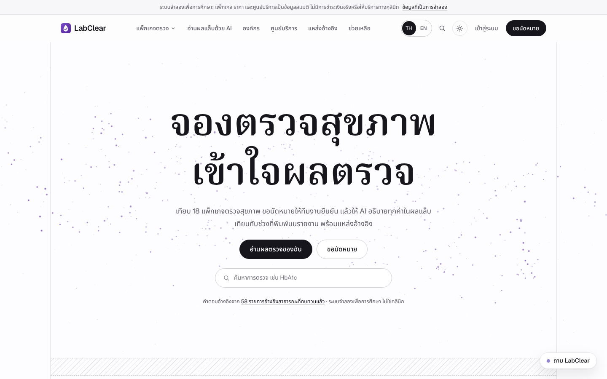
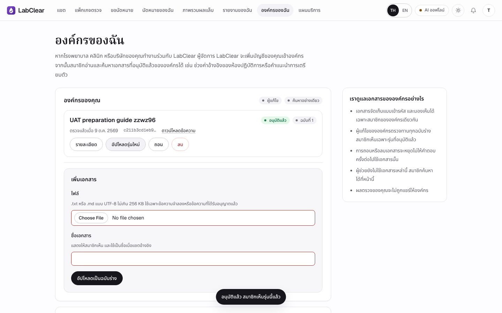

# LabClear 4.0.0-rc1 (รุ่นรวม) รายงานทางเทคนิค

**วิชา** 06048308 Intelligent Chatbot Development · Final Project

**ผู้พัฒนา** นายวัชรินทร์ บัวสอน (68076055) · นายศิริพล ศรีเฮงไพบูลย์ (68076060)

**รุ่น** 4.0.0-rc1 · ฐาน Codex `main` `c970410` · branch `integration/labclear-4.0-rc1` · commit ที่ทดสอบ `c8f3547` · **วันที่** 9 ตุลาคม 2569

> รายงานนี้เดิมเขียนให้ Claude branch 4.0.0 (`release/4.0.0`, commit `95bf3d7`) ซึ่งเลือก Cloudflare Workers Paid และชุดโมเดล OpenRouter แบบเร็ว ฉบับนี้ปรับให้ตรงกับ **รุ่นรวม** ที่ใช้ backend ของ Codex กับหน้าเว็บของ Claude ข้อเท็จจริงทั้งหมดอ้างอิง [release-4.0.0.md](../release-4.0.0.md), [หลักฐานของรุ่นรวม](../evidence/integration-4.0-rc1/README.md) และโค้ดใน repository
> รุ่นรวมเป็น candidate สำหรับตรวจรับ ยังไม่ได้ merge ยังไม่ได้ deploy ยังไม่ได้เรียกผู้ให้บริการ AI จริง และไม่ได้แก้ ENV ของระบบจริง ความสามารถใหม่ของ Codex ทั้ง 6 flag ปิดเป็นค่าเริ่มต้น

## 1. สรุป

LabClear เป็นแชตบอตของคลินิกตรวจสุขภาพจำลอง ลูกค้าถามเรื่องแพ็กเกจ ราคา และการนัดหมายได้ ส่งภาพใบผลแล็บให้ AI อ่าน ยืนยันค่า แล้วได้คำอธิบายภาษาไทยพร้อมแหล่งอ้างอิง ส่วนเจ้าหน้าที่ใช้หน้า `/staff` ยืนยันนัด ตอบลูกค้า ออกใบเสนอราคา กำหนดสมาชิกองค์กร และคุมงบ AI

รุ่นรวมตอบความเห็นของ CEO 5 ข้อหลังการนำเสนอความก้าวหน้า โดยประกอบงานสองชุดที่ทำแยกกัน

| ส่วน | มาจาก | ในรุ่นรวม |
|---|---|---|
| Backend FastAPI, ความปลอดภัย, การไม่เก็บแชตผู้เยี่ยมชม, model harness, เอกสารองค์กร, ลิงก์โรงพยาบาล, สัญญา API | Codex `main` | คงไว้ทั้งหมด |
| ส่วนต่อขยาย backend | รุ่นรวม (ดัดแปลงจาก Claude) | `routers/public.py` แบบอ่านอย่างเดียว, `TRUSTED_ORIGINS` (ว่างเป็นค่าเริ่มต้น), `/site/membership`, `VERSION = 4.0.0-rc1` |
| หน้าเว็บ Next.js 16 + React 19 + React Three Fiber ภาษาไทยเป็นค่าเริ่มต้น | Claude 4.0.0 | นำมาใช้ ปรับเฉพาะจุดที่สัญญา API ต่างกัน |
| Deploy | Codex (Render เดิม) | `render.yaml` ไม่เปลี่ยน เว็บเป็นบริการ Render ตัวที่สองแบบเลือกได้ |
| Cloudflare Workers Paid + Containers | Claude 4.0.0 | เลื่อนไว้ เก็บไฟล์ครบ ไม่ใช้ |
| ฐานความรู้ | Codex 58 รายการที่ตรวจแล้ว | ระเบียนที่ Claude เขียนเพิ่ม 90 รายการอยู่ในคิวรอตรวจ ไม่ถูกค้น |

| ข้อ | ความเห็น CEO | ผลในรุ่นรวม |
|---|---|---|
| 1 | แหล่งอ้างอิงน้อยและเจาะจงบางโรงพยาบาล อยากให้ลูกค้าองค์กรอัปโหลดเอกสารของโรงพยาบาลเองได้ | ฐานที่ค้นคง 58 รายการ แหล่งใหม่เข้าคิวรอตรวจ เอกสารองค์กรใช้ระบบของ Codex (สมาชิก ร่าง อนุมัติ รุ่น ถอน) และเพิ่มหน้าลิงก์โรงพยาบาล |
| 2 | ถ้าไม่ได้เข้าสู่ระบบ ประวัติแชตหายเมื่อรีเฟรช | คงการล้างเมื่อรีเฟรช และใช้กฎของ Codex ที่ลบแชตผู้เยี่ยมชมเมื่อเข้าสู่ระบบ พร้อมกันคำตอบเก่าแสดงทับบัญชีใหม่ |
| 3 | ย้ายจาก Render ไป Cloudflare บนโดเมนที่ทีมซื้อไว้ | เจ้าของเปลี่ยนเป้าหมายกลับเป็น Render เดิม Cloudflare Workers Paid เลื่อนไว้ แผนฟรีใช้เป็น DNS/proxy ได้ภายหลัง |
| 4 | ใช้ OpenRouter key ของทีม เลือกโมเดลถูก ดี เร็ว งบ USD 10 และพิจารณา embedding | model harness ของ Codex: เลือกผู้ให้บริการต่อ slot และ agent บทบาทใหม่ปิดเป็นค่าเริ่มต้น เพดาน 300 บาท embedding เลื่อนไว้ |
| 5 | หน้าเว็บเน้นภาษาไทย ใช้ Next/React/Three ได้ ให้เด่นและเข้าใจง่าย | ใช้เว็บ Next.js ของ Claude ทั้งชุด ภาษาไทยเป็นค่าเริ่มต้น สลับ EN ได้ |

หลักฐานของรุ่นรวม (commit `c8f3547`, ข้อมูลจำลองและตัวแทนโมเดล): pytest ผ่าน 277, browser เดิมของ Codex ผ่าน 36/36, ชุด upgrade ของ Codex ผ่าน 10/10, offline fixture 60/60, Render entrypoint smoke ผ่าน, web UAT ของ Next.js ผ่าน 53/53 และชุดที่ปิด flag ทั้งหมดผ่าน 5/5 คุณภาพคำตอบกับโมเดลจริงยังต้องวัดหลัง deploy

## 2. ธุรกิจและขอบเขต

LabClear จำลองคลินิกตรวจสุขภาพขนาดเล็กที่มี 3 ศูนย์ (กรุงเทพฯ อารีย์ เชียงใหม่ สุเทพ ขอนแก่น) เปิดจันทร์–เสาร์ 07:00–16:00 น. ขายสองอย่าง

- **แพ็กเกจตรวจสุขภาพ 18 รายการ** แพ็กเกจหลัก 4 รายการจองได้ทันที (เริ่ม ฿1,190) การตรวจติดตาม 11 รายการต้องให้ทีมงานพิจารณาก่อน และแพ็กเกจองค์กร 3 รายการสำหรับ 20 คนขึ้นไป
- **AI Lab Report** แผนฟรีอ่านผลได้ 1 รายงาน แผน Plus ฿355 ต่อ 30 วัน อ่านใบผลหลายหน้าและดูผลย้อนหลัง

ข้อมูลธุรกิจ ราคา การชำระเงิน และใบผลแล็บทั้งหมดเป็นข้อมูลสมมติ แชตบอตต้องตอบจากแค็ตตาล็อก นโยบาย และฐานความรู้ที่ตรวจแล้วเท่านั้น ห้ามวินิจฉัย ห้ามสั่งยาหรือบอกขนาดยา ห้ามแต่งราคาหรือส่วนลด และห้ามเปิดเผยข้อมูลลูกค้าคนอื่น การจอง การชำระ และการคืนเงินเกิดขึ้นหลังลูกค้ากดยืนยันและเจ้าหน้าที่ตรวจเท่านั้น รายละเอียดอยู่ใน [business.md](../business.md) และ [chatbot-spec.md](../chatbot-spec.md)

## 3. การออกแบบระบบ

### 3.1 องค์ประกอบ

| ชั้น | องค์ประกอบ | หน้าที่ |
|---|---|---|
| Web (เลือกได้) | บริการ Render `labclear-web`: Node 22, Next.js 16 | หน้าสาธารณะเป็น server component ส่วน `/app` และ `/staff` เป็น client component; `next.config.ts` rewrite `/api/*` และ `/health` ไปที่ `API_ORIGIN` |
| API | บริการ Render `labclear`: Python 3.12, FastAPI (Codex, `render.yaml` เดิม) | session, CSRF, origin, rate limit, ทุกการทำงานทางธุรกิจ และหน้า Jinja เดิม รัน 1 instance |
| Core | `business_agent`, `conversation_guard`, `report_reader_v2`, `conversation_transport`, `cost_ledger` | pipeline ของแชต การตรวจความปลอดภัย การอ่านใบผล และด่านก่อนเรียกโมเดล |
| Core (opt-in) | `model_harness`, `runtime_skills`, `organization_sources` | Medical analyzer และ Thai composer, คำสั่งภาษาไทยที่ตรวจ hash แล้ว, เอกสารองค์กร (ทำงานเมื่อเปิด flag) |
| Data | `knowledge/evidence/catalog.json` | ฐานความรู้ 58 รายการ ค้นด้วย BM25 |
| Data | `knowledge/acquisition/` | คิวแหล่งรอตรวจ (Codex 15 + 6, Claude 90) ไม่ถูกค้น |
| Data | Render PostgreSQL (SQLite ในเครื่อง) | ตาราง `rs_entities` ทุกแถวเข้ารหัส Fernet ด้วย `BUSINESS_DATA_KEY` |
| External | ผู้ให้บริการ AI ตาม slot | ค่าเริ่มต้น Typhoon (โมเดลภาษา), iApp OpenThai-SystemOne (safety), Typhoon OCR; ผู้จัดการเปลี่ยนเป็น OpenRouter หรือรายอื่นได้ |

### 3.2 หน้าเว็บกับ API บน Render

เบราว์เซอร์คุยกับบริการเว็บเพียง origin เดียว cookie `labclear_session` (HttpOnly, SameSite=Strict) จึงเป็นของโดเมนเว็บ บริการเว็บส่งต่อ `/api/*` ไปยังบริการ API ด้วย HTTPS คำขอที่ไปถึง API มี `Host` ของ API แต่ `Origin` ของเว็บ กฎเดิมของ Codex ที่ให้ `Origin` ตรงกับ `Host` จึงปฏิเสธคำขอนี้ รุ่นรวมเพิ่ม `services/trusted_origins.py` และค่า `TRUSTED_ORIGINS` ที่เทียบ origin แบบตรงตัวทั้ง scheme, host และ port ไม่รับ wildcard, path หรือ credential ค่าเริ่มต้นว่าง API จึงทำงานแบบเดิมจนกว่าเจ้าของจะใส่ origin ของเว็บ การตรวจ `Sec-Fetch-Site: cross-site` ยังปฏิเสธเสมอ

ทางเลือกที่พิจารณา: ส่งออกหน้าเว็บเป็นไฟล์ static ให้ FastAPI เสิร์ฟ (origin เดียวโดยไม่ต้อง proxy) ต้องเปลี่ยนหน้าแบบ dynamic หลายหน้า เช่น `/lab-report/[id]` จึงไม่ทำในรอบนี้ ส่วน CORS แบบมี credential ต้องเปลี่ยน cookie เป็น SameSite=None ซึ่งเพิ่มช่องโจมตีข้ามไซต์

### 3.3 ข้อมูล

ข้อมูลถาวรทุกชนิดอยู่ในตารางเดียว `rs_entities(id, kind, owner, state, branch, payload, created)` โดย `payload` เป็น JSON ที่เข้ารหัส Fernet เอกสารองค์กรของ Codex เป็นแถวชนิด `organization_source` ที่มีสถานะ `draft`, `approved`, `rejected`, `revoked` หรือ `deleted` และสมาชิกองค์กรเก็บเป็นฟิลด์ `organization_id` กับ `organization_role` ในแถวผู้ใช้ รุ่นรวมไม่เพิ่มตารางหรือ schema

ข้อมูลของผู้เยี่ยมชม (ข้อความ ภาพ ผลอ่านใบผล) ไม่ลงฐานข้อมูล อยู่ใน RAM ของ process Python เดียว บริการ API จึงต้องมี instance เดียว

## 4. ข้อความหนึ่งข้อความเดินทางอย่างไร

1. เบราว์เซอร์ POST `/api/business/chat` พร้อม `Accept: application/x-ndjson` ไปที่บริการเว็บ ซึ่ง rewrite ไปยัง FastAPI
2. ตรวจ session, CSRF, origin (Host หรือ `TRUSTED_ORIGINS`) และ rate limit แล้วบันทึกข้อความ (บัญชีลง PostgreSQL ผู้เยี่ยมชมลง RAM)
3. ถ้าเปิดเอกสารองค์กร ตรวจซ้ำว่าแหล่งส่วนตัวที่เคยใช้ในประวัติยังอนุมัติและเป็นขององค์กรเดิม ถ้าไม่ใช่ ข้อความนั้นถูกตัดออกจาก context
4. ตรวจรูปแบบการโจมตีด้วย regex ภาษาไทยและอังกฤษ ถ้าพบจะหยุดโดยไม่เรียกโมเดล แล้วตรวจข้อความเข้าด้วย safety model
5. Planner เลือก action บทบาท และคำค้น
6. ค้น BM25 บนฐาน 58 รายการ และข้อความที่อนุมัติแล้วขององค์กรเฉพาะเมื่อเปิด `ORG_REFERENCE_INFERENCE_ENABLED` และผู้ให้บริการทุกตัวที่รับข้อมูลตั้งค่าแล้วและไม่ใช่โมเดล `:free`
7. ผู้เขียนคำตอบตามบทบาทเขียน JSON พร้อมรหัสแหล่งอ้างอิง (เพิ่มคำสั่งจาก `runtime_skills` เมื่อเปิด `RUNTIME_SKILLS_ENABLED` และใช้ Medical analyzer + Thai composer กับใบผลจำลองในระบบเมื่อเปิด `MEDICAL_HARNESS_ENABLED`)
8. Python ตรวจ citation ค่าผลตรวจ จำนวนเงินเทียบแค็ตตาล็อก และขอบเขตของบทบาท แก้ได้หนึ่งรอบ แล้ว reviewer ตรวจ และตรวจความปลอดภัยขาออก
9. บันทึกคำตอบ แหล่งอ้างอิง (เอกสารองค์กรมีรุ่น ตำแหน่ง และ SHA-256) และขั้นตอน แล้วส่งผลลัพธ์เป็นบรรทัดสุดท้ายของ stream

ไปป์ไลน์ของ Codex เรียกโมเดลทีละครั้งตามลำดับ ข้อความปกติใช้ 5 ครั้ง และไม่เกิน 8 ครั้งเมื่อมีการแก้ ทุกการเรียกต้องผ่าน `PROVIDER_NETWORK_ENABLED` เพดานจำนวนครั้ง (`CLOUD_CALL_LIMIT` ค่าเริ่มต้น 200 ต่อ `PROVIDER_BUDGET_CYCLE_ID`) และบัญชีค่าใช้จ่ายบาท (`PROJECT_BUDGET_THB` 300 บาท) ก่อนเสมอ ขั้นใดล้มเหลว ระบบหยุดและแสดงสาเหตุพร้อมปุ่มลองใหม่ (fail closed) ลูกค้าเห็นแต่ละขั้นแบบ stream และดูย้อนหลังได้ใต้คำตอบ

การอ่านใบผลในแชตใช้ Typhoon OCR หน้าละหนึ่งครั้ง (เมื่อเปิด `VISION_ENABLED`) safety check ตรวจข้อความที่อ่านได้ในฐานะเอกสาร โมเดลภาษาแปลงเป็นแถว แล้วตรวจแถวอีกครั้ง Python คำนวณว่าค่าอยู่ใน สูงกว่า หรือต่ำกว่าช่วงที่พิมพ์บนใบผล แล้วรอให้ลูกค้ายืนยันก่อนอธิบาย

## 5. การตัดสินใจตามความเห็น CEO

### 5.1 แหล่งอ้างอิงและเอกสารขององค์กร (ข้อ 1)

**ฐานความรู้** Claude branch เคยขยายเป็น 135 รายการจาก 24 ผู้เผยแพร่ แต่ 77 รายการที่เพิ่มเขียนจากความรู้โดยไม่ได้เปิดหน้าเว็บต้นทาง (`verification.url_checked=false`) และมีร่างอีก 13 รายการของโรงพยาบาลที่ไม่มีลิงก์บทความเฉพาะ รุ่นรวมคงฐานที่ค้นไว้ที่ 58 รายการที่ตรวจแล้วของ Codex และย้ายทั้ง 90 รายการไปไว้ที่ `knowledge/acquisition/claude_candidates_400.json` สถานะ `NOT_APPROVED` (หน่วยงานรัฐไทย 5 สมาคมวิชาชีพไทย 13 โรงพยาบาลไทย 13 หน่วยงานสากล 27 แหล่งอ้างอิงสากล 32 รวม 26 ผู้เผยแพร่) การทดสอบใน `tests/test_integration_400.py` ยืนยันว่ารายการเหล่านี้ไม่ปะปนกับฐานที่ใช้งาน `python scripts/verify_sources.py --candidates` ช่วยตรวจได้เพียงว่าลิงก์ยังเปิดได้

**trade-off** ผู้ใช้ยังได้แหล่งอ้างอิงจาก 4 ผู้เผยแพร่เท่าเดิมจนกว่าจะตรวจแหล่งใหม่ แต่ไม่มีความเสี่ยงที่ระบบจะอ้างข้อความที่ไม่มีใครเทียบกับต้นฉบับ

**เอกสารขององค์กร** รุ่นรวมใช้ระบบของ Codex แทนระบบรหัสเข้าร่วมของ Claude branch

| ขั้น | ผู้ทำ | รายละเอียด |
|---|---|---|
| กำหนดสมาชิก | ผู้จัดการ LabClear | `/staff` → Organization membership: บัญชีที่ลงทะเบียนแล้ว + รหัสองค์กร `org_…` + บทบาท reader หรือ editor (`PUT /organization-documents/membership`) |
| อัปโหลด | ผู้แก้ไขขององค์กร | `/app` → My organization: TXT หรือ Markdown แบบ UTF-8 ไม่เกิน 256 KiB เก็บแบบเข้ารหัสเป็นร่าง ปฏิเสธไฟล์ซ้ำและไฟล์ที่ไม่ใช่ข้อความ องค์กรละไม่เกิน 100 ฉบับ |
| ตรวจ | ผู้แก้ไขขององค์กร | ดูตัวอย่าง แล้วอนุมัติหรือไม่อนุมัติ รุ่นใหม่ (`previous_id`) แทนรุ่นเดิมเมื่ออนุมัติ ถ้ารุ่นที่อนุมัติเปลี่ยนไประหว่างนั้นระบบปฏิเสธ |
| ค้นและดาวน์โหลด | สมาชิก | ข้อความต้นฉบับพร้อมรุ่นและบรรทัด ป้าย "ไม่ใช่คำตอบจาก AI" ดาวน์โหลดได้เฉพาะสมาชิกองค์กรเดียวกัน |
| ถอนหรือลบ | ผู้แก้ไขขององค์กร | คำตอบครั้งต่อไปใช้ไม่ได้ทันที การลบลบเนื้อหาออก |
| ใช้กับผู้ช่วย | เจ้าของระบบ | เปิด `ORG_REFERENCE_INFERENCE_ENABLED` หลังทบทวนนโยบายข้อมูลของผู้ให้บริการ (ปิดเป็นค่าเริ่มต้น) |

หน้า My organization ของเว็บ Next.js ถูกเขียนใหม่ตามสัญญานี้บนโครงหน้า การ์ด และ class เดิมของ Claude และถาม `GET /site/membership` ก่อน ผู้ที่ไม่ใช่สมาชิกจึงไม่เจอคำตอบ 403 หน้า staff "Organizations" และ "Reference document review" ของ Claude ไม่ได้นำมา เพราะใน Codex ผู้แก้ไขขององค์กรเป็นผู้ตรวจเอกสาร

**ลิงก์โรงพยาบาล** รุ่นรวมนำข้อมูลของ Codex มาแสดงที่ `/hospital-links` ของเว็บ Next.js (`HOSPITAL_LINKS_ENABLED`) ราคาแสดงเฉพาะข้อเสนอที่ตรวจแล้วและยังไม่หมดอายุ ลิงก์ไม่ส่ง referrer และไม่อ้างว่าเป็นพันธมิตรหรือจองได้

### 5.2 ประวัติแชตของผู้เยี่ยมชม (ข้อ 2)

ความเห็นนี้มีสองทางแก้ที่ขัดกัน: เก็บแชตไว้ในเบราว์เซอร์ให้ยังอยู่หลังรีเฟรช หรือคงการล้างไว้เพื่อความเป็นส่วนตัว คำถามเรื่องผลตรวจเป็นข้อมูลสุขภาพ เจ้าของโครงการจึงเลือก **ล้างทุกครั้งที่รีเฟรช** Claude branch เคยเพิ่มตัวเลือก "เก็บแชตนี้ไว้ในบัญชี" ตอนเข้าสู่ระบบ แต่ Codex กำหนดให้การเข้าสู่ระบบหรือสมัครบัญชีลบแชตผู้เยี่ยมชมและภาพ (ฟิลด์ `keep_guest_chat` ถูกปฏิเสธโดย schema แบบ strict) รุ่นรวมจึงใช้กฎของ Codex

| กลไก | ที่อยู่ในโค้ด |
|---|---|
| token ของผู้เยี่ยมชมอยู่ในหน่วยความจำของหน้าเท่านั้น ไม่ใช้ localStorage, sessionStorage, IndexedDB หรือ cookie | `web/lib/api/client.ts` |
| เมื่อปิดหรือรีเฟรช เบราว์เซอร์ส่ง beacon ไป `/api/business/guest/close` ให้เซิร์ฟเวอร์ลบข้อมูลใน RAM ทันที | `client.ts`, `routers/business.py` |
| หน้าที่กลับมาจาก back/forward cache ถูกโหลดใหม่ | `client.ts` (`pageshow`) |
| แถบ "โหมดผู้เยี่ยมชม" และหน้าต่างเข้าสู่ระบบแจ้งว่าแชตชั่วคราวจะถูกลบ | `web/components/chat/guest.tsx`, `web/components/SignInDialog.tsx` |
| เข้าสู่ระบบส่งเฉพาะ email และรหัสผ่าน หน้าเว็บล้างข้อความออกทันที | `client.ts`, `Workspace.tsx`, `DockPanel.tsx`, `engine.ts` |
| คำตอบ `/workspace` ที่ขอในนามตัวตนเดิมถูกทิ้ง (`api.identity`) | `Workspace.tsx`, `DockPanel.tsx` |
| ผู้เยี่ยมชมที่ไม่ใช้งาน 20 นาที หรือ process restart ข้อมูลหาย | `services/guest_memory.py` |

หลักฐาน: UAT R4-02, R4-03 (เข้าสู่ระบบแล้วข้อความหายทันที หลังรีเฟรช และในบัญชี), R4-04 (หน่วงคำตอบ `/workspace` ของผู้เยี่ยมชม 3.5 วินาทีระหว่างสมัครบัญชีแล้วยืนยันว่าไม่แสดงทับ) และ UI-33 ทั้งในเว็บ Next.js และชุดเดิมของ Codex

### 5.3 Deploy: กลับมาใช้ Render (ข้อ 3)

| ทางเลือก | ข้อดี | ข้อเสีย / สถานะ |
|---|---|---|
| **บริการ API เดิม + บริการเว็บ Next.js ตัวที่สองบน Render (รุ่นรวม)** | ไม่เปลี่ยน `render.yaml` และบริการที่ใช้งานอยู่ ไม่มีค่าแผน Workers Paid ถอยกลับได้ง่าย | สองบริการต้อง build และหลับแยกกัน rate limit ผ่านเว็บใช้ bucket เดียว ต้องตั้ง `TRUSTED_ORIGINS` |
| หน้า Jinja เดิมของ Codex บนบริการ API เท่านั้น | ไม่มีบริการเพิ่ม | ไม่ได้หน้าเว็บ Next.js ที่ CEO ขอ ยังใช้ได้เป็นทางสำรอง |
| Cloudflare Worker 2 ตัว + Container + PostgreSQL ภายนอก (Claude branch) | origin เดียวผ่าน service binding | ต้องใช้ Workers Paid และ Docker เจ้าของเลือกเลื่อนไว้ |

ขั้นตอนอยู่ใน [deploy/render-web.md](../deploy/render-web.md): Root Directory `web`, build `npm ci && npm run build`, start `npm run start:render`, ENV `NODE_VERSION=22`, `API_ORIGIN=https://<API>` และเจ้าของตั้ง `TRUSTED_ORIGINS=https://<เว็บ>` ที่ API ตัวอย่าง blueprint อยู่ที่ `deploy/render/web-service.example.yaml` (ไม่ถูกอ่านอัตโนมัติ) หน้าเว็บสาธารณะรอ API ไม่เกิน 2.5 วินาที ถ้า API ยังไม่ตื่นจะใช้ข้อมูล seed ที่ bundle ไว้

งาน Cloudflare (`deploy/cloudflare/`, `Dockerfile`, `scripts/container_start.py`, `web/worker.ts`, `web/wrangler.jsonc`, สคริปต์ deploy) เก็บไว้เป็นทางเลือก workflow ของ GitHub Actions ย้ายไป `deploy/cloudflare/ci/` เพื่อไม่ให้ deploy เองเมื่อ push และ Docker image เพิ่ม `runtime_skills/` ที่ transport ของ Codex อ่านทุกครั้งที่เรียกโมเดล ค่า `vars` ใน wrangler อ้างการตั้งค่าของ Claude branch ที่ backend ของ Codex ไม่มี ต้องทำใหม่ก่อนใช้ ([deploy/cloudflare/README.md](../../deploy/cloudflare/README.md)) Cloudflare แผนฟรีใช้เป็น DNS/proxy หน้า Render ได้โดยไม่ต้องใช้ไฟล์ชุดนี้

### 5.4 โมเดลและงบ (ข้อ 4)

รุ่นรวมใช้ model harness ของ Codex แทนชุดโมเดลที่ฝังไว้

| เรื่อง | ในรุ่นรวม |
|---|---|
| Slot | โมเดลภาษา (`llm`), safety (`guard`), อ่านใบผล (`vision`) ค่าเริ่มต้น Typhoon `typhoon-v2.5-30b-a3b-instruct`, iApp OpenThai-SystemOne, Typhoon OCR |
| Agent เดิม 4 ตัว | Planner, Health-check Advisor, Report Explainer, Reviewer ใช้โมเดลภาษากลางเว้นแต่ตั้งแยก |
| บทบาทใหม่ 2 ตัว | Medical analyzer และ Thai composer ปิดเป็นค่าเริ่มต้น ไม่สืบทอดคีย์ ต้องระบุโมเดลตรงตัวและราคาที่ตรวจแล้ว บน OpenRouter ต้องระบุ endpoint ที่ทบทวนแล้ว และคำขอใช้ `allow_fallbacks: false`, `data_collection: deny`, `zdr: true` |
| สถานะ | หน้า AI providers แสดง `DISABLED`, `NOT_CONFIGURED`, `SCHEMA_CHECK_ONLY`; การทดสอบจริงยังไม่มีบันทึก (`NOT_RUN`) |
| Registry | `runtime_skills/model_registry.json` เป็น metadata ของโมเดลที่พิจารณา ราคา `PRICE_UNVERIFIED` ไม่ใช่การเลือกหรือสิทธิ์เรียก |
| งบ | เพดานโครงการ 300 บาท ต้องระบุค่าใช้จ่ายก่อนหน้า และเพดานจำนวนครั้งต่อรอบ Codex เสนอให้ประเมินจริงในวง USD 1 เมื่อเจ้าของอนุมัติ |
| Embedding | เลื่อนไว้จนกว่าจะมีผลเปรียบเทียบการค้นคืน |

หน้า AI providers ของเว็บ Next.js ถูกปรับตามสัญญานี้: แสดง 9 ขั้น (โมเดลภาษา 6 agent safety OCR) ช่องรหัส endpoint สำหรับบทบาทใหม่ ไม่เติมราคาเริ่มต้นให้บทบาทใหม่ และนำปุ่ม "ชุดโมเดลแบบเร็ว" กับแผงความพร้อมของ Claude ออก เพราะ endpoint เหล่านั้นไม่มีใน Codex

**trade-off** ยังไม่มีโมเดลใดที่วัดแล้วว่าดีและถูกสำหรับงานนี้ การไม่ฝังค่าเริ่มต้นทำให้ต้องตั้งค่าเองหลัง deploy แต่ไม่มีการอ้างประสิทธิภาพที่ไม่ได้วัด

**ข้อเสนอเดิมของ Claude branch (ไม่ได้ใช้ในรุ่นรวม)** ชุด OpenRouter คีย์เดียว: planner `qwen/qwen3-30b-a3b-instruct-2507`, ผู้เขียนและ OCR `google/gemini-3.1-flash-lite`, reviewer และ safety `openai/gpt-4.1-mini`, embedding `qwen/qwen3-embedding-8b` ตรวจความปลอดภัยขนานกับ planner และ reviewer ค่าประมาณ USD 0.008 ต่อคำตอบจากราคา snapshot 7 ต.ค. 2569 และงบในระบบ 360 บาท ตัวเลขเป็นสมมติฐานที่ไม่เคยวัดกับ usage จริง

### 5.5 หน้าเว็บภาษาไทยบน Next.js (ข้อ 5)

รุ่นรวมใช้เว็บ Next.js 16 (App Router) + React 19 + React Three Fiber ของ Claude branch ภาษาไทยเป็นค่าเริ่มต้นและสลับ EN ได้ ทุกข้อความผ่าน `t("English source")` คำแปลไทย 2,260 รายการ (เพิ่ม 174 รายการสำหรับส่วนที่ปรับ) และ `npm run i18n:check` ผ่าน หน้าแรกมี DNA helix สามมิติ รายงานผลตัวอย่างที่กดดูคำอธิบายได้ และผู้ที่ตั้ง reduced motion เห็น helix แบบนิ่ง

| งานของ Claude | ในรุ่นรวม |
|---|---|
| Design system ฟอนต์ไทย ธีม TH/EN หน้าเว็บสาธารณะ แชต พื้นที่ลูกค้า staff desk | ใช้ตามเดิม แก้ข้อความเรื่องเอกสารองค์กร การเข้าสู่ระบบ และจำนวนแหล่งให้ตรง Codex |
| เข้าสู่ระบบพร้อม "เก็บแชตนี้" | ส่งเฉพาะ email และรหัสผ่าน ล้างหน้าจอทันที กันคำตอบเก่า |
| My organization | เขียนใหม่ตามสัญญา Codex บนโครงหน้าเดิม |
| Staff: Organizations, Reference document review | แทนด้วย Organization membership |
| Staff: AI providers | ปรับเป็น 3 slot + 6 agent บทบาทใหม่ปิด สถานะการตั้งค่า registry |
| ป้ายองค์กรในแชต | แสดงสถานะ (ใช้กับผู้ช่วย หรือค้นหาอย่างเดียว) แทนการเลือกต่อแชต |
| หน้าใหม่ | `/hospital-links` และสคริปต์ `start:render` |
| Backend ของ Claude (`routers/org.py`, `org_knowledge`, keep-chat, fast profile, ตรวจขนาน, semantic search) | ไม่ได้นำมา ยังอยู่ใน `release/4.0.0` ใน bundle |

**trade-off** ระบบมีสอง runtime (Node สำหรับหน้าเว็บ Python สำหรับ API) และหน้าเว็บสองชุด (Next.js และ Jinja เดิมของ Codex) ต้องระวังไม่แก้หน้าผิดชุด หน้า Jinja ยังจำเป็นเพราะชุดทดสอบของ Codex และ landing preview ใช้หน้าเหล่านั้น

## 6. ความปลอดภัยและความเป็นส่วนตัว

LabClear ใช้ guardrail สามแบบตามที่เรียน คือ กฎ โมเดลจัดประเภท และการตรวจในโค้ด ทุกชั้นล้มเหลวแบบปิด (fail closed)

| ชั้น | สิ่งที่ป้องกัน |
|---|---|
| ขนาดข้อความ 8,000 ตัวอักษร ไฟล์ไม่เกิน 3 ไฟล์ × 3 MB rate limit 120 ครั้ง/นาที | การใช้ทรัพยากรเกินขอบเขต |
| cookie HttpOnly + SameSite=Strict, CSRF, ตรวจ Origin เทียบ Host หรือ `TRUSTED_ORIGINS` แบบตรงตัว, Google sign-in แบบ state + PKCE + nonce | คำขอข้ามไซต์และการยึดบัญชี |
| regex ภาษาไทย/อังกฤษก่อนเรียกโมเดล | prompt injection แบบตรง ๆ |
| safety model บนข้อความ คำตอบ และเอกสาร | คำขอหรือคำตอบที่ไม่ปลอดภัย คำสั่งที่ซ่อนในภาพ |
| Python ตรวจ citation ค่าผลตรวจ ราคา และขอบเขตบทบาท | แหล่งอ้างอิงปลอม ค่าถูกเปลี่ยน ราคาแต่งเอง |
| reviewer (ตั้งเป็นโมเดลต่างตระกูลได้) | คำกล่าวที่แหล่งอ้างอิงไม่รองรับ การวินิจฉัย |
| การจองและชำระต้องให้ลูกค้ายืนยันและเจ้าหน้าที่ตรวจ | โมเดลลงมือเอง |
| เอกสารองค์กร: สมาชิกจากผู้จัดการ ผู้แก้ไขอนุมัติ แยกองค์กร ตรวจซ้ำในประวัติ ส่งให้ผู้ช่วยเฉพาะเมื่อเปิด flag และผู้ให้บริการพร้อมและไม่ใช่ `:free` | ข้อมูลรั่วข้ามองค์กร เอกสารที่ถอนแล้วกลับมาใช้ |
| บทบาทใหม่บน OpenRouter: endpoint ที่ทบทวนแล้ว ไม่สลับผู้ให้บริการ `data_collection: deny`, `zdr` | ข้อมูลไปยังผู้ให้บริการที่ไม่ได้เลือก |
| log ข้อผิดพลาดของผู้ให้บริการเก็บเฉพาะ slot และสถานะ HTTP | ข้อความหรือคีย์รั่วใน log |
| `PROVIDER_NETWORK_ENABLED` เพดานจำนวนครั้ง และงบ 300 บาท | ค่าใช้จ่ายบานปลาย |

การจับคู่กับ OWASP Top 10 for LLM: LLM01 prompt injection (regex, safety model, การตรวจในโค้ด, reviewer, การอนุมัติเอกสารองค์กร), LLM02 การเปิดเผยข้อมูล (ข้อมูลแยกตามเจ้าของและองค์กร คีย์เข้ารหัสและไม่ส่งถึงเบราว์เซอร์ log แบบ metadata), LLM04 การวางยาข้อมูล (ฐานความรู้ตรวจ hash แหล่งใหม่รอตรวจ เอกสารองค์กรต้องอนุมัติ), LLM05 การจัดการผลลัพธ์ (ลบลิงก์และ HTML, DOMPurify, CSP), LLM06 การให้อำนาจเกิน (preview และการยืนยัน), LLM09 ข้อมูลผิด (citation ต้องมีจริงและรองรับคำตอบ), LLM10 การใช้ทรัพยากรไม่จำกัด (rate limit และงบ)

ด้านความเป็นส่วนตัว: ข้อมูลบัญชีเข้ารหัสทุกแถว เจ้าหน้าที่เห็นว่าลูกค้าแชร์ใบผล แต่ไม่เห็นภาพหรือค่า ข้อมูลผู้เยี่ยมชมอยู่ใน RAM และถูกลบเมื่อรีเฟรชหรือเข้าสู่ระบบ เอกสารองค์กรไม่ถูกส่งไปยังผู้ให้บริการ AI จนกว่าจะเปิด `ORG_REFERENCE_INFERENCE_ENABLED` ระบบไม่สร้าง embedding รายละเอียดอยู่ใน [safety.md](../safety.md)

## 7. หลักฐานการทดสอบ

ทุกการตรวจของรุ่นรวมรันบน commit `c8f3547` วันที่ 9 ต.ค. 2569 ใช้ข้อมูลจำลอง ฐานข้อมูลชั่วคราว ตัวแทนโมเดลและ OCR และไม่เรียกผู้ให้บริการจริง ไฟล์ผลอยู่ใน [docs/evidence/integration-4.0-rc1/](../evidence/integration-4.0-rc1/README.md)

| การตรวจ | ผล | ใช้โมเดลจริงหรือไม่ |
|---|---|---|
| `python scripts/offline_check.py pytest -q` | 277 ผ่าน (Codex 265 + รุ่นรวม 12) | ไม่ (ปิดการเชื่อมต่อออก) |
| `node tests/browser/uat.cjs` (หน้า Jinja ของ Codex) | 36/36 | ไม่ |
| `node tests/browser/upgrade.cjs` (preview, ลิงก์โรงพยาบาล, เอกสารองค์กร) | 10/10 | ไม่ |
| `python scripts/offline_check.py evaluation` | 60 fixture ผ่าน `LIVE_MODEL_EVALUATION=NOT_RUN` | ไม่ |
| `python scripts/offline_check.py boot` (entrypoint ของ Render) | เริ่มและหยุดได้ ตรวจ 8 เส้นทาง | ไม่ |
| `npx tsc --noEmit`, `npm run i18n:check`, `npm run build` | ผ่าน (16 routes) | — |
| `node tests/uat.mjs` (เว็บ Next.js บน `next start` ต่อกับ API จริงผ่าน rewrite) | 53/53 ไม่มี browser error | ไม่ (`scripts/dev_mock_api.py`) |
| `node tests/uat-flags-off.mjs` (flag ใหม่ปิดทั้งหมด) | 5/5 | ไม่ |

12 ข้อใหม่ใน pytest ครอบคลุม `/site/*` ที่ไม่สร้าง session และไม่มีข้อมูลส่วนบุคคล การนับแหล่ง 58 รายการ flag ที่ปิดเป็นค่าเริ่มต้น ลิงก์โรงพยาบาลตาม flag การปฏิเสธ origin ที่ไม่ได้ระบุหรือใกล้เคียง (subdomain, http, port, wildcard) การยอมรับ origin ที่ระบุตรงตัวทั้งใน API ธุรกิจและการตรวจของ AI endpoint `/site/membership` ที่บอกเฉพาะบทบาทของผู้เรียกเอง และคิวแหล่งรอตรวจที่ไม่ถูกค้น

Web UAT มาจาก 51 สถานการณ์ของ Claude branch สถานการณ์ที่ทดสอบสัญญาเฉพาะของ Claude ถูกเขียนใหม่ตาม Codex (R4-03, R4-04, R4-05, R4-06, R4-07) และเพิ่ม R4-15 กับ R4-13-hospital-links

**ข้อสังเกต** การทดสอบ UI-33 ในชุดเดิมของ Codex ถอดรหัสภาพย่อก่อนที่ blob ของภาพจะโหลดเสร็จ บน Linux ชุด baseline ของ Codex (`c970410`) ที่ไม่ได้แก้ผ่าน 1 ใน 2 รอบ และรุ่นรวมไม่ผ่าน 2 ใน 2 รอบ การรันที่ใส่ log ยืนยันว่าภาพโหลดได้หลังจากนั้นเล็กน้อย จึงแก้เฉพาะการทดสอบให้รอ blob (commit `c8f3547`) ไม่ได้แก้โค้ดของระบบ

**ผลของ Claude branch 4.0.0 (ไม่ใช่ผลของรุ่นรวม)** บน commit `95bf3d7`: pytest 261 ผ่าน (backend ของ Claude ที่ไม่ได้นำมา), UAT 51/51 บน OpenNext production build ผ่าน `wrangler dev`, `opennextjs-cloudflare build` และ `wrangler deploy --dry-run` ทั้งสอง worker ผล UAT 49/51 ที่เคยเขียนในรายงานฉบับก่อนเป็นของรอบก่อนแก้ UI-21 และ UI-22

**สิ่งที่ยังไม่ได้ทดสอบ** ยังไม่ได้เรียกผู้ให้บริการ AI จริง จึงยังไม่รู้คุณภาพภาษาไทย ความถูกต้องของ JSON และ OCR ความเร็ว และราคาจริงของรุ่นนี้ ยังไม่ได้สร้างบริการเว็บบน Render ยังไม่ได้ต่อ PostgreSQL ของระบบจริง ยังไม่ได้ทดสอบบนมือถือจริงและ screen reader ชุดทดสอบของวิชา (คำถาม 10 ข้อ ภาพ 5 ภาพ ความปลอดภัย 5 กรณี) ต้องรันด้วย `scripts/course_eval.py` หลัง deploy และให้คนตรวจทุกกรณี

ผลรอบจริงครั้งแรกเมื่อ 7 ต.ค. บนรุ่น 3.0 (คำถามผ่าน 7/10 ภาพ 4/5 ความปลอดภัย 5/5) รอบ 2 และรอบ 3 (Typhoon บน Render) บันทึกไว้ใน [testing.md](../testing.md) เป็นหลักฐานของรุ่นก่อน รอบที่ 4 บนรุ่น 3.0.2 ถูกหยุดด้วยเพดานจำนวนครั้ง จึงไม่มีผลคุณภาพ

## 8. การดำเนินงาน

| เรื่อง | วิธี |
|---|---|
| ตรวจรับ | นำเข้า bundle ตรวจ diff และผลทดสอบ แล้วเจ้าของ merge เข้า `main` เอง (ไม่มีการ push จากงานนี้) |
| Deploy API | Render deploy บริการ `labclear` ตาม `render.yaml` เดิม ไม่ต้องเพิ่มคีย์ใหม่ flag ใหม่ยังปิด |
| Deploy เว็บ (เลือกได้) | ตาม [deploy/render-web.md](../deploy/render-web.md) แล้วเจ้าของตั้ง `TRUSTED_ORIGINS` ที่ API |
| ตรวจสถานะ | `/health` แสดง `version` 4.0.0-rc1 และ `commit` ของทั้งสองบริการ |
| คุมงบ | `PROVIDER_NETWORK_ENABLED`, `CLOUD_CALL_LIMIT` ต่อ `PROVIDER_BUDGET_CYCLE_ID`, `PROJECT_BUDGET_THB=300`, `PROJECT_BUDGET_PRIOR_SPEND_THB` ยอดดูได้ที่ `/staff` → Channels and budget |
| เปิดความสามารถใหม่ | ทีละ flag ตาม [MORNING_HANDOFF](../ceo-upgrade/MORNING_HANDOFF.md) และ [ENV_HANDOVER](../ceo-upgrade/ENV_HANDOVER.md) |
| ย้อนรุ่น | ปิด flag ก่อน ถ้าต้องย้อนโค้ด ให้เลือก deploy ก่อนหน้าบน Render หรือ revert commit ห้าม force-push ห้ามรีเซ็ตฐานข้อมูล คีย์ หรือยอดใช้จ่าย |
| ปัญหาที่คาดไว้ | 403 `origin_rejected` ผ่านเว็บ = `TRUSTED_ORIGINS` ไม่ตรง origin ของเว็บ; หน้าเว็บแสดงข้อมูล seed = API ยังหลับ; AI ไม่ตอบ = `PROVIDER_NETWORK_ENABLED` หรือรอบงบยังไม่ตั้ง |

## 9. ข้อจำกัดและงานต่อไป

**ข้อจำกัด**

- คุณภาพ ความเร็ว และราคาของโมเดลยังไม่ได้วัดกับรุ่นนี้
- rate limit ของ API นับตาม IP ที่ต่อเข้ามา ผู้ใช้ผ่านบริการเว็บจึงใช้ bucket เดียวกัน (120 ครั้ง/นาที)
- Google sign-in ผ่านบริการเว็บยังไม่ได้ทดสอบ
- API มี instance เดียว แชตผู้เยี่ยมชมหายเมื่อ restart และแผนฟรีของ Render หลับเมื่อไม่มีการใช้งาน
- ฐานที่ค้นยังมี 4 ผู้เผยแพร่ แหล่งใหม่ 111 รายการรอตรวจ
- เอกสารองค์กรรับเฉพาะ TXT/MD และค้นด้วยการจับคู่คำ ไม่รองรับ PDF, DOCX หรือ OCR
- ข้อมูลธุรกิจและผลตรวจเป็นข้อมูลจำลอง ระบบให้ข้อมูลสุขภาพทั่วไป ไม่วินิจฉัยโรค

**งานต่อไป**

1. เจ้าของตรวจรับ bundle merge แล้ว deploy บน Render ตรวจ `/health`
2. สร้างบริการเว็บและตั้ง `TRUSTED_ORIGINS` แล้วตรวจรับตามคู่มือ
3. ออกแบบการนับ rate limit ผ่านบริการเว็บ และทดสอบ Google sign-in
4. อนุมัติงบประเมินจริงภายในเพดาน รันชุดทดสอบของวิชา เก็บผลดิบ และให้คนตรวจทุกกรณี
5. ตรวจแหล่งความรู้ที่รอ แล้วย้ายเฉพาะที่ผ่านเข้า `catalog.json`
6. เปิด flag ใหม่ทีละตัวตามประตูของเจ้าของ
7. ทดสอบบนมือถือจริงและ screen reader

## ภาคผนวก ก. Endpoint ที่เว็บ Next.js ใช้และที่เพิ่มในรุ่นรวม

| Method | Path | ใช้ทำอะไร |
|---|---|---|
| POST | `/api/business/login`, `/register` | email และรหัสผ่านเท่านั้น แชตผู้เยี่ยมชมของหน้านั้นถูกลบ |
| POST | `/api/business/guest/close` | beacon ลบแชตผู้เยี่ยมชมเมื่อปิดหรือรีเฟรชหน้า |
| GET | `/api/business/site/common`, `/site/home`, `/site/sources`, `/site/packages/{id}`, `/site/compare` | ข้อมูลสาธารณะสำหรับหน้าเว็บ ไม่มี session และข้อมูลส่วนบุคคล (เพิ่มในรุ่นรวม) |
| GET | `/api/business/site/features`, `/site/hospital-links` | flag แบบ true/false และลิงก์โรงพยาบาล (เพิ่มในรุ่นรวม) |
| GET | `/api/business/site/membership` | บทบาทองค์กรของผู้เรียกเอง (เพิ่มในรุ่นรวม) |
| GET, POST | `/api/business/organization-documents`, `/search` | รายการ อัปโหลดร่าง และค้นข้อความต้นฉบับ (Codex) |
| GET, POST | `/api/business/organization-documents/{id}`, `/{id}/download`, `/{id}/{approve,reject,revoke,delete}` | ดูตัวอย่าง ดาวน์โหลด และเปลี่ยนสถานะ (Codex) |
| PUT | `/api/business/organization-documents/membership` | ผู้จัดการกำหนดสมาชิก (Codex) |
| GET, PUT, DELETE, POST | `/api/business/staff/ai-providers`, `/registry`, `/{slot}`, `/{slot}/test` | ผู้จัดการตั้งผู้ให้บริการ ดู registry และทดสอบ 1 ครั้ง (Codex) |

รายการเต็มอยู่ใน [api.md](../api.md)

## ภาคผนวก ข. ค่าตั้งที่สำคัญ

| ค่า | ค่าเริ่มต้น | ความหมาย |
|---|---|---|
| `LANDING_PREVIEW_ENABLED`, `ORG_DOCUMENTS_ENABLED`, `ORG_REFERENCE_INFERENCE_ENABLED`, `HOSPITAL_LINKS_ENABLED`, `RUNTIME_SKILLS_ENABLED`, `MEDICAL_HARNESS_ENABLED` | `false` | ความสามารถใหม่ของ Codex เปิดทีละตัวหลังผ่านประตูของเจ้าของ |
| `TRUSTED_ORIGINS` | ว่าง | origin ของบริการเว็บที่ API ยอมรับ (เพิ่มในรุ่นรวม) |
| `LLM_PROVIDER`, `GUARD_PROVIDER`, `VISION_PROVIDER` | `typhoon`, `iapp_systemone`, `typhoon_ocr` | ผู้ให้บริการสำรองจาก environment ค่าที่บันทึกในหน้า AI providers มีลำดับเหนือกว่า |
| `VISION_ENABLED` | `false` | การอ่านใบผลด้วย OCR |
| `PROVIDER_NETWORK_ENABLED` | `false` | การเรียกผู้ให้บริการทั้งหมด |
| `PROVIDER_BUDGET_CYCLE_ID`, `CLOUD_CALL_LIMIT` | ว่าง, `200` | รอบและเพดานจำนวนครั้ง |
| `PROJECT_BUDGET_THB`, `PROJECT_BUDGET_PRIOR_SPEND_THB` | `300`, ว่าง | งบรวมของโครงการและยอดที่ใช้ก่อนหน้า (ว่าง = ไม่ให้เรียกแบบมีค่าใช้จ่าย) |
| `DATABASE_URL`, `BUSINESS_DATA_KEY` | — | ต้องมีบนระบบที่ host ห้ามหมุนคีย์โดยไม่ย้ายข้อมูล |
| `API_ORIGIN` (บริการเว็บ) | `http://127.0.0.1:8000` | URL ของบริการ API ที่เว็บส่งต่อ `/api` |

ค่าทั้งหมดอยู่ใน `config.py` และ [ENV_HANDOVER](../ceo-upgrade/ENV_HANDOVER.md) ค่าที่ผู้จัดการบันทึกในหน้า AI providers มีลำดับเหนือ environment ยกเว้นบทบาทใหม่ที่ไม่มีค่าสำรองจาก environment
